# Statistics for Data Science

**Pipeline covered:** DATA, DESCRIPTIVE, DIAGNOSTIC, PREDICTIVE, PRESCRIPTIVE, ACTION

## Table of Contents

- [Master Map](#master-map)
- [Part 0: Philosophy of This Guide](#part-0-philosophy-of-this-guide)
- [Part 1: DATA](#part-1-data)
- [Part 2: DESCRIPTIVE ANALYTICS](#part-2-descriptive-analytics)
- [Part 3: FOUNDATION: PROBABILITY AND DISTRIBUTIONS](#part-3-foundation-probability-and-distributions)
- [Part 4: DIAGNOSTIC ANALYTICS](#part-4-diagnostic-analytics)
- [Part 5: PREDICTIVE ANALYTICS](#part-5-predictive-analytics)
- [Part 6: PRESCRIPTIVE ANALYTICS](#part-6-prescriptive-analytics)
- [Part 7: ACTION](#part-7-action)
- [Part 8: REFERENCE](#part-8-reference)

---

## Master Map

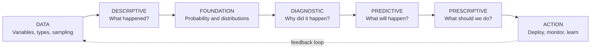
```mermaid
flowchart LR
    A["DATA<br/>Variables, types, sampling"] --> B["DESCRIPTIVE<br/>What happened?"]
    B --> P["FOUNDATION<br/>Probability and distributions"]
    P --> C["DIAGNOSTIC<br/>Why did it happen?"]
    C --> D["PREDICTIVE<br/>What will happen?"]
    D --> E["PRESCRIPTIVE<br/>What should we do?"]
    E --> F["ACTION<br/>Deploy, monitor, learn"]
    F -.->|feedback loop| A
```

| Stage | Core question | Main tools in this guide |
|---|---|---|
| Data | What are we measuring and how was it collected? | Variable types, measurement levels, sampling |
| Descriptive | What happened? | Frequency tables, charts, central tendency, variation, position, shape, box plots |
| Foundation | How do we quantify uncertainty? | Probability, conditional probability, Bayes, random variables, distributions |
| Diagnostic | Why did it happen? | Hypothesis tests, t-tests, proportion tests, chi-square, correlation, association |
| Predictive | What will happen? | Regression, forecasting, classification, model evaluation |
| Prescriptive | What action is best? | Expected value framework, cut-off selection, optimization, personalization |
| Action | How do we put it to work? | Deployment, monitoring, experiments, communication |

---

# Part 0: Philosophy of This Guide

## 0.1 Users versus developers of statistics

- **Algorithm developers** need deep mathematics and statistics: proving theorems, creating new algorithms, theoretical development. They are typically academic researchers.
- **Data science practitioners** use statistical tools. Their job is to read, interpret and apply results to business problems.
- Software computes every statistic automatically. The scarce skill is knowing which tool to use, reading the output, and turning it into a decision.

| What practitioners need | What algorithm developers need |
|---|---|
| Read statistical measures | Deep mathematical knowledge |
| Interpret results for the business | Theoretical development |
| Apply methods to real problems | Prove theorems |
| No need to memorize formulas | Create new algorithms |

> Our job is not to calculate. Computers do that. Our job is to read and interpret results for business applications.

## 0.2 Applied probability

- The focus is applied probability: concepts and interpretation, not heavy calculation.
- Traditional statistics works with population-level probabilities (for example, "the surgery success rate is 80%").
- Data science goes to the individual level. Each case gets its own probability based on its own attributes (age, history, behavior).

---

# Part 1: DATA

## 1.1 What is statistics?

Statistics is the science of **collecting, organizing, summarizing and analyzing** data in order to reach conclusions and make informed decisions.

| Step | Process | Example: warehouse temperature monitoring |
|---|---|---|
| 1 | Collection | Record temperature readings from sensors in a cold-storage warehouse |
| 2 | Organization | Arrange readings in tables or graphs |
| 3 | Summarization | Compute measures such as the mean (for example, 4.8 C) |
| 4 | Analysis | Check whether readings stay below the safety threshold of 6 C |
| 5 | Conclusion | Decide whether extra cooling units or daily inspections are needed |

**Branches of statistics**

| Branch | Purpose |
|---|---|
| Descriptive statistics | Summarize the data you have |
| Inferential statistics | Generalize from a sample to a population (hypothesis tests, confidence intervals) |

## 1.2 Fundamental definitions

| Term | Definition | Example |
|---|---|---|
| Variable | Any attribute or characteristic that can take different values | Weight, gender, eye color, delivery time |
| Data | The actual values that variables take | 62 kg, Female, 34 minutes |
| Observation (record) | One row: all values for one subject | One customer |
| Dataset | A collection of observations | A table of 5,000 customers |

Example dataset (column headers are variables; cell contents are data):

| CustomerID | City | Plan | MonthlySpend |
|---|---|---|---|
| 101 | Leeds | Basic | 24.50 |
| 102 | Porto | Premium | 61.00 |

## 1.3 Types of variables

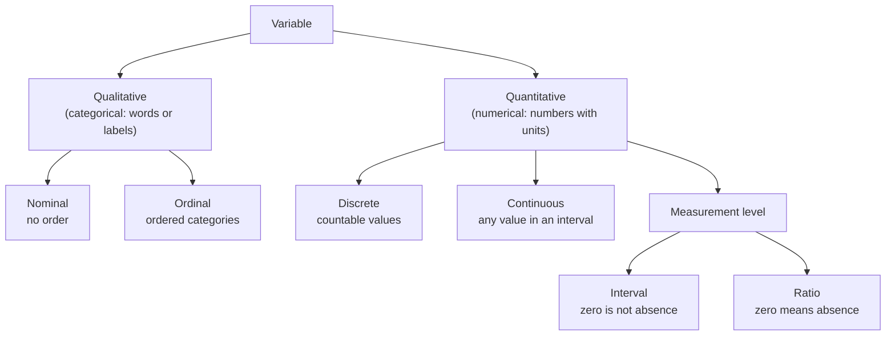
```mermaid
flowchart TD
    V["Variable"] --> QL["Qualitative<br/>(categorical: words or labels)"]
    V --> QN["Quantitative<br/>(numerical: numbers with units)"]
    QL --> NOM["Nominal<br/>no order"]
    QL --> ORD["Ordinal<br/>ordered categories"]
    QN --> DIS["Discrete<br/>countable values"]
    QN --> CON["Continuous<br/>any value in an interval"]
    QN --> LV["Measurement level"]
    LV --> INT["Interval<br/>zero is not absence"]
    LV --> RAT["Ratio<br/>zero means absence"]
```

**Qualitative (categorical) variables** take word or category values. Examples: grade (A to F), gender, eye color, nationality, marital status, city, software supplier, payment method.

**Quantitative (numerical) variables** take numeric values with measurement units and can be ordered or ranked. Examples: age (years), temperature (degrees), time (seconds), income (currency), number of students.

| Type | Definition | Examples | Key idea |
|---|---|---|---|
| Discrete | Countable values | Number of parcels, number of absences, number of cars | Even if the number is very large, it can still be counted |
| Continuous | Any value within an interval | Height, weight, time, temperature | Infinitely many values between two points; cannot count them all |

**Important note about identifiers**

- ID numbers, phone numbers, postal codes and account numbers are treated as **qualitative**.
- Reason: they have no measurement unit and cannot be meaningfully ordered or averaged. They act as names or labels even though they look like numbers.

## 1.4 Levels of measurement

| Data kind | Level | Definition | Examples |
|---|---|---|---|
| Qualitative | Nominal | Categories with no order or rank | Eye color, gender, nationality, specialization |
| Qualitative | Ordinal | Categories that can be ranked | Grades A to F, economic status (low, middle, high), hotel star rating |
| Quantitative | Interval | Numeric; zero does NOT mean "nothing" | Temperature in Celsius (0 C is a temperature, not absence of it) |
| Quantitative | Ratio | Numeric; zero means "nothing" | Number of orders = 0 means no orders; height, weight, income |

**Why levels matter:** they determine which statistics and tests are valid.

| Level | Valid summaries | Typical tests |
|---|---|---|
| Nominal | Mode, frequency | Chi-square, association measures |
| Ordinal | Median, quartiles, mode | Rank-based (Spearman, Mann-Whitney) |
| Interval | Mean, SD, median | t-tests, Pearson |
| Ratio | All of the above, ratios, CV | t-tests, Pearson, regression |

## 1.5 Independent and dependent variables

| Role | Definition | Examples |
|---|---|---|
| Independent (predictor, X) | Not affected by other variables in the study | Gender, age, income (in some studies) |
| Dependent (outcome, Y) | Changes when independent variables change | Spending, experience, cancer risk |

| Independent | Dependent | Relationship |
|---|---|---|
| Income | Spending | Higher income, higher spending |
| Age | Experience | Older, more experience |
| Smoking | Cancer risk | More smoking, higher risk |
| Advertising budget | Sales | More advertising, higher sales |

## 1.6 Population versus sample

| Concept | Definition |
|---|---|
| Population | All subjects under study |
| Sample | A subset of the population |
| Parameter | A numerical summary of a population (mu, sigma) |
| Statistic | A numerical summary of a sample (x-bar, s) |

**Why use samples:** we cannot study the entire population, and time and cost are limited. Results are then generalized to the population with inferential statistics.

**Note for data science:** with big data you often hold the complete population, but sampling techniques still matter (for quick testing, labeling, surveys, and building balanced training sets).

## 1.7 Sampling techniques

| Technique | Method | Use when | Example |
|---|---|---|---|
| Random (simple) | Every item has an equal chance; select randomly | Population is fairly uniform | Number 500 customers and draw 50 random numbers |
| Systematic | Select every n-th item | An ordered list or a flow of people exists | Survey every 8th shopper leaving a store |
| Stratified | Divide into strata, then sample from each (proportionally) | Distinct subgroups exist and all must be represented | A hospital study with nurses, doctors, technicians and administrators; pure random sampling might pick mostly nurses (the largest group) |
| Cluster | Naturally divide into similar groups, randomly select whole clusters, study everyone inside | Population is spread across natural groups | A company study on canteen food: each office building is a cluster; randomly choose 3 buildings and survey everyone in them |

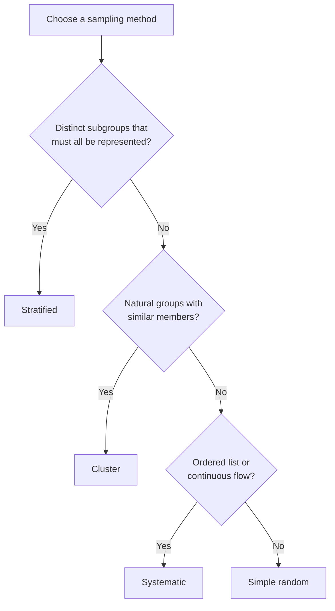
```mermaid
flowchart TD
    S["Choose a sampling method"] --> Q1{"Distinct subgroups that<br/>must all be represented?"}
    Q1 -->|Yes| STR["Stratified"]
    Q1 -->|No| Q2{"Natural groups with<br/>similar members?"}
    Q2 -->|Yes| CLU["Cluster"]
    Q2 -->|No| Q3{"Ordered list or<br/>continuous flow?"}
    Q3 -->|Yes| SYS["Systematic"]
    Q3 -->|No| RND["Simple random"]
```

**Additional cautions**

- Convenience sampling (whoever is easy to reach) creates selection bias.
- Non-response and survivorship bias can distort results even with a good design.
- Larger samples reduce random error, not bias.

## 1.8 The Data-to-Action approach

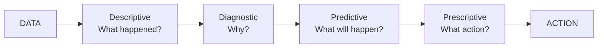
```mermaid
flowchart LR
    D["DATA"] --> DE["Descriptive<br/>What happened?"]
    DE --> DI["Diagnostic<br/>Why?"]
    DI --> PR["Predictive<br/>What will happen?"]
    PR --> PS["Prescriptive<br/>What action?"]
    PS --> AC["ACTION"]
```

**Running example for this guide: meal-kit subscription churn**

| Stage | Question | Example analysis |
|---|---|---|
| Descriptive | What happened? Which customers cancelled most? | Age analysis, city analysis, plan analysis |
| Diagnostic | Why did it happen? | Why did customers on the Family plan cancel most? Check box price, delivery delays, recipe variety, support quality |
| Predictive | What will happen? | Score each customer's probability to cancel next month; list high-risk customers |
| Prescriptive | What action should we take? | Personalized treatment for each customer (see below) |

**Prescriptive difference from the traditional approach**

| Traditional | Prescriptive |
|---|---|
| One solution for everyone (a 20% discount for all Family plan customers) | Customized solution for each individual |
| | Customer A complains about late deliveries: offer a priority delivery slot and a credit |
| | Customer B (same profile as A) keeps skipping weeks: offer a flexible pause or a smaller box |

## 1.9 Statistical tools by stage

| Stage | Tool | Purpose |
|---|---|---|
| Descriptive | Frequency tables | Summarize categorical data |
| Descriptive | Visualization | Bar charts, pie charts, histograms |
| Descriptive | Central tendency | Mean, median, mode |
| Descriptive | Dispersion | Standard deviation, variance, range |
| Diagnostic | Hypothesis testing | Test differences between groups |
| Diagnostic | t-tests | Compare dependent and independent samples |
| Diagnostic | Chi-square tests | Test independence and homogeneity |
| Diagnostic | Correlation | Measure linear relationships |
| Diagnostic | Association | Measure categorical relationships |
| Predictive | Regression | Predict numeric outcomes |
| Predictive | Classification | Predict categories |
| Predictive | Probability models | Calculate likelihoods |
| Prescriptive | Classification | Recommend specific actions |
| Prescriptive | Optimization | Find best solutions |

---

# Part 2: DESCRIPTIVE ANALYTICS

## 2.1 What is descriptive statistics?

Tools, rules and formulas used to **summarize and understand data**.

**Common measures:** mean, median, mode, variance, standard deviation, skewness, z-score, range, IQR.

**Purposes**

- Summarize data so it is easier to understand.
- Assess data quality before using it in projects.
- Identify issues such as outliers and extremes.
- Enable data understanding at a glance.

**The four families of measures**

| Category | Purpose | Key measures |
|---|---|---|
| Central tendency | Find the center or typical value | Mean, median, mode, quartiles |
| Variation (dispersion) | Describe spread | Range, IQR, variance, SD, CV, variation ratio |
| Position | Locate a value relative to others | Z-score, percentiles, quartiles |
| Shape | Describe the distribution shape | Skewness, kurtosis |

## 2.2 Frequency tables

A table with two columns: **categories** and their **frequency (count)**. Extended versions add relative frequency and percentage.

Example: payment method of 200 orders

| Payment method | Frequency | Relative frequency | Percentage |
|---|---|---|---|
| Card | 90 | 0.45 | 45% |
| Wallet | 60 | 0.30 | 30% |
| Cash | 30 | 0.15 | 15% |
| Bank transfer | 20 | 0.10 | 10% |
| **Total** | **200** | **1.00** | **100%** |

- Relative frequency = Frequency / Total
- Percentage = Relative frequency x 100

## 2.3 Data visualization

**Purpose for a data scientist:** to understand the data first and present it second. Focus on insight, not aesthetics.

| Chart | Data type | Use | Notes |
|---|---|---|---|
| Bar chart | Categorical | Compare frequency of categories | X: categories; Y: count |
| Pie chart | Categorical | Show proportions of a whole | Slice size is percentage |
| Histogram | Quantitative (continuous) | Show distribution across bins | Bars touch each other |
| Tree map | Hierarchical categorical | Rectangle size shows frequency or percentage | Colors distinguish categories |
| Line chart | Time series | Show trends over time | X: time; Y: measured value |
| Scatter plot (very important) | Two quantitative variables | Show relationship | Reveals linear or non-linear pattern, direction, strength, outliers; example: advertising spend versus sales |
| Web chart (very important) | Two or more qualitative variables | Show associations between categories | Line thickness shows strength (thick is strong, thin is weak); interactive: click a link to see counts, filter categories |
| Box plot | Quantitative | Show distribution and outliers | Min, Q1, median, Q3, max; compare groups |

**Web chart example:** subscription plan by cancellation status. A thick line between "Family plan" and "Cancelled" suggests a strong association worth investigating; a thin line between "Solo plan" and "Cancelled" suggests a weak one. This helps risk assessment (for example, which education levels or plans have higher default or churn).

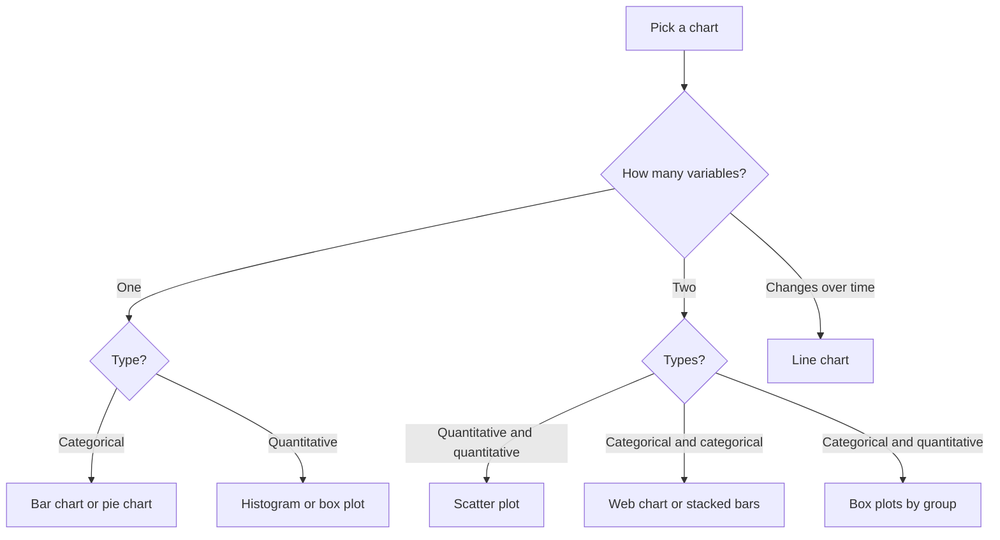
```mermaid
flowchart TD
    S["Pick a chart"] --> A{"How many variables?"}
    A -->|One| B{"Type?"}
    A -->|Two| C{"Types?"}
    A -->|Changes over time| L["Line chart"]
    B -->|Categorical| BC["Bar chart or pie chart"]
    B -->|Quantitative| BQ["Histogram or box plot"]
    C -->|Quantitative and quantitative| CS["Scatter plot"]
    C -->|Categorical and categorical| CW["Web chart or stacked bars"]
    C -->|Categorical and quantitative| CB["Box plots by group"]
```

## 2.4 Measures of central tendency

Measures that identify the **central or most typical value** around which data clusters.

**Mean (average)**

- The value around which most data points cluster.
- Reading it: mean delivery time = 30 minutes means most deliveries take around 30 minutes and nearby values.
- Use: a quick one-number summary. Sensitive to outliers.

**Median**

- The value that divides ordered data into two equal halves (50% below, 50% above).
- Use for ordered or ranked data, skewed distributions, or when outliers exist.
- Example: median basket value = $48 means half of the baskets are below $48 and half above.

**Mode**

- The most frequent value. Can be **bimodal or multimodal**.
- The **only** option for nominal data.
- Example: mode of payment method = "Card". Most customers pay by card.

**Quartiles**

| Quartile | Also called | Percent below |
|---|---|---|
| Q1 | First quartile | 25% |
| Q2 | Second quartile (equals the median) | 50% |
| Q3 | Third quartile | 75% |

```text
 Min           Q1          Q2 (Median)        Q3           Max
  |------25%----|-----25%-----|------25%-------|-----25%-----|
```

**Choosing among mean, median and mode**

| Situation | Best measure |
|---|---|
| Symmetric numeric data, no outliers | Mean |
| Skewed numeric data or outliers | Median |
| Nominal data | Mode |
| Ordinal data | Median or mode |

**Extension:** the weighted mean multiplies each value by a weight (for example, an average score weighted by credit hours).

## 2.5 Why central tendency alone is not enough

Two couriers, each with a mean delivery time of 30 minutes:

| Courier | Delivery times (min) | Mean | Reality |
|---|---|---|---|
| Nadia | 30, 30, 30 | 30 | Consistently 30 |
| Omar | 15, 30, 45 | 30 | Mean is 30 but times vary widely (15 to 45) |

Same mean, very different reliability. Solution: **measures of variation**.

## 2.6 Measures of variation (dispersion)

These describe how data **spreads, scatters or deviates** from the center. They show whether the mean or median truly represents the data, reveal consistency, and are essential for data quality assessment.

**Range**

- Range = Maximum - Minimum.
- Advantage: simplest, quick overview.
- Disadvantage: heavily affected by outliers.
- Example: junior developer salaries are $3,000 to $5,000. Add one CEO at $53,000 and the range becomes $50,000. It looks like salaries vary enormously, but a single outlier causes it.

**Interquartile range (IQR)**

- IQR = Q3 - Q1. Covers the middle 50% of the data.
- **Not affected by outliers**, since extreme values sit outside Q1 to Q3. More reliable than the range.
- Reading: IQR = 9 years means the middle half of the data spans 9 years.

**Variance**

- Average of squared deviations from the mean.
- Units are squared (hard to interpret directly).
- Sample variance: s squared = sum of (x - mean) squared, divided by (n - 1).

**Standard deviation (SD)**

- The square root of the variance: the typical deviation from the mean, in original units.
- Think of SD as a **ruler with units**:

```text
Mean-3SD   Mean-2SD   Mean-1SD    Mean    Mean+1SD   Mean+2SD   Mean+3SD
    |----------|----------|----------|----------|----------|----------|
                  one SD = one step of the ruler
```

- Example: mean order value = $52.3, SD = $8. Normal range = 52.3 +/- 8 = $44.3 to $60.3.
- **Low SD** (near zero): tightly clustered. **High SD**: widely scattered.

**Coefficient of variation (CV)**

- CV = (SD / Mean) x 100.
- Purpose: compare variation across **different units or scales**.
- Example: delivery time has mean 30 min and SD 5 min (CV = 16.7%). Order value has mean $60 and SD $12 (CV = 20%). Order value is relatively more variable, even though 5 and 12 cannot be compared directly.
- Higher CV means more variation; lower CV means more homogeneous.

**Variation ratio (qualitative data)**

- VR = 1 - (Frequency of mode / Total). Only for nominal variables.
- Example (payment methods above): mode = Card (90 of 200). VR = 1 - 0.45 = 0.55.
- Closer to 1: more variation across categories. Closer to 0: one category dominates.

**How to judge whether SD or variation is high or low**

| Method | Idea | Example |
|---|---|---|
| 1. Context (relative to the mean) | Compare SD with the size of the mean | Mean wage $200, SD $50: large (25% of mean). Mean wage $2,000, SD $50: small (2.5%) |
| 2. Prior studies and benchmarks | Published research, industry norms, academic papers | Compare with the typical SD in the sector |
| 3. Machine learning context | Models need a balance | See below |

**Machine learning context**

| Variation level | Effect on a model |
|---|---|
| Too high | The model cannot find repeated patterns |
| Too low | No diversity; overfitting risk; nothing to learn from differences |
| Moderate | Enough repetition and enough diversity to learn |

Analogy: teaching a child to recognize fruit.

- Good dataset (moderate variation): many apples in different sizes and shades, plus some oranges and bananas, each seen repeatedly.
- Too high variation: each fruit seen exactly once (a dragon fruit, a quince, a lychee, a medlar), so no pattern can be learned.
- Too low variation: one apple photographed 1,000 times, so the model learns only that apple.

## 2.7 Measures of position

These determine the **location of a value relative to all other values**.

**Z-score (standard score)**

- z = (value - mean) / SD. It tells how many SDs a value is from the mean.
- Purpose: compare values from **different datasets or units**; standardize variables for modeling.
- Analogy: you cannot compare a square in box A with a triangle in box B. Convert both to circles in a neutral box (z-scores) and then compare.

Example: Priya scored 78 in Statistics (class mean 70, SD 4) and 85 in Programming (class mean 80, SD 10).

| Subject | Score | Mean | SD | Z-score | Position |
|---|---|---|---|---|---|
| Statistics | 78 | 70 | 4 | (78 - 70) / 4 = 2.0 | Exceptional |
| Programming | 85 | 80 | 10 | (85 - 80) / 10 = 0.5 | Slightly above average |

Priya is relatively stronger in Statistics despite the lower raw score.

Other applications: compare a salary in euros with one in yen, compare income with expenses, standardize variables before clustering.

**Percentile**

- The percentage of data that falls **below** a value.
- The 90th percentile means 90% scored below and 10% scored above.
- Use: admissions or ranking based on position, not raw score.

**Quartiles as position measures**

Q1 = 25th percentile, Q2 = 50th percentile (median), Q3 = 75th percentile.

**Empirical rule (for roughly bell-shaped data)**

| Range | Approximate share of data |
|---|---|
| Mean +/- 1 SD | 68% |
| Mean +/- 2 SD | 95% |
| Mean +/- 3 SD | 99.7% |

## 2.8 Identifying outliers

**Outliers** are values extremely far from the center of the data (unusually high or low).

**Why they matter**

- They pull the mean strongly.
- They distort the range.
- They can ruin model performance.
- They may indicate data quality issues, or important insights.

**IQR fence method**

```text
Lower bound = Q1 - 1.5 x IQR
Upper bound = Q3 + 1.5 x IQR
Any value outside [Lower bound, Upper bound] is an outlier
```

**Z-score method:** values with an absolute z-score above 3 (sometimes above 2.5) are flagged. It is less robust than the IQR method because outliers inflate the mean and SD.

**What to do with outliers**

| Cause | Action |
|---|---|
| Data entry or sensor error | Correct or remove |
| Genuine but rare value | Keep; consider robust methods (median, non-parametric) or a transformation |
| Different population | Analyze separately |

## 2.9 Worked example: delivery times

Nine delivery times in minutes: 22, 25, 25, 28, 30, 32, 35, 38, 95.

| Measure | Value | Reading |
|---|---|---|
| Mean | 330 / 9 = 36.7 | Pulled upward by the 95 |
| Median | 30 | Half of deliveries take 30 minutes or less |
| Mode | 25 | Most frequent value |
| Q1 | 25 | 25% of deliveries take 25 minutes or less |
| Q3 | 36.5 | 75% take 36.5 minutes or less |
| Range | 95 - 22 = 73 | Inflated by one delivery |
| IQR | 36.5 - 25 = 11.5 | Middle half spans 11.5 minutes |
| Variance (sample) | 4036 / 8 = 504.5 | Squared units |
| SD | about 22.5 | Large spread |
| CV | 22.5 / 36.7, about 61% | Highly variable |
| Fences | Lower: 25 - 17.25 = 7.75; Upper: 36.5 + 17.25 = 53.75 | 95 lies outside, so it is an outlier |
| Z-score of 95 | (95 - 36.7) / 22.5, about 2.6 | Far above the mean |
| Mean without the outlier | 235 / 8 = 29.4 | Close to the median |

**Interpretation:** mean (36.7) is greater than median (30), which is greater than mode (25). This is the signature of a right-skewed distribution caused by one extreme delay. Report the median and investigate the 95-minute delivery (road closure? data error?).

## 2.10 Skewness (shape)

Skewness describes the **symmetry** of a distribution.

| Type | Description | Relationship | Skewness | Example |
|---|---|---|---|---|
| Symmetric | Bell in the middle | Mean = Median = Mode | About 0 | Adult heights |
| Positive (right-skewed) | Data concentrated on the left; long tail to the right | Mode, then Median, then Mean (increasing) | Above 0 | Income, delivery times, house prices |
| Negative (left-skewed) | Data concentrated on the right; long tail to the left | Mean, then Median, then Mode (increasing) | Below 0 | Exam scores when most students score high |

```text
Symmetric                      Right-skewed (positive)
        ***                        **
      *     *                     *  *
    *         *                  *    **
  *             *               *       ****
 *_______________*             *____________*******
   mean = median = mode         mode  median  mean
                                   long tail ->

Left-skewed (negative)
                 **
                *  *
              **    *
        ****        *
 *******____________*
          mean  median  mode
    <- long tail
```

| Skewness value | Interpretation |
|---|---|
| About 0 | Symmetric |
| 0 to +1 | Slightly right-skewed |
| Greater than +1 | Highly right-skewed |
| 0 to -1 | Slightly left-skewed |
| Less than -1 | Highly left-skewed |

Reading example: skewness = 3.9 is highly positive: data heavily concentrated at lower values with a long right tail.

**Practical rule:** use the median (not the mean) for skewed data.

## 2.11 Kurtosis (peakedness and tails)

Kurtosis measures how **compressed or stretched** the distribution is (excess kurtosis; a normal distribution is about 0).

| Type | Kurtosis | Shape | Tails |
|---|---|---|---|
| Mesokurtic | About 0 | Standard bell curve | Normal |
| Leptokurtic | Above 0 | Tall, narrow peak; data compressed at the center | Heavy tails, more outliers |
| Platykurtic | Below 0 | Flat, wide; data spread out | Light tails, fewer outliers |

Reading example: kurtosis = -0.61 means slightly flat and spread out.

## 2.12 Box plot

A box plot shows the minimum, Q1, median, Q3, maximum and outliers in one picture.

```text
        o            <- outlier (above the upper fence)
        |
   -----+-----       <- upper whisker end (largest non-outlier)
        |
   +----+----+
   |         |       <- Q3
   |---------|       <- Median (Q2)
   |         |       <- Q1
   +----+----+
        |
   -----+-----       <- lower whisker end (smallest non-outlier)
        |
        o            <- outlier (below the lower fence)

Fences: Q1 - 1.5 x IQR   and   Q3 + 1.5 x IQR
```

| Component | Meaning |
|---|---|
| Box | Q1 to Q3 (middle 50% of data) |
| Line inside the box | Median |
| Whiskers | Extend to the smallest and largest non-outlier values |
| Dots | Outliers beyond the whiskers |

**Reading skewness from a box plot (horizontal view)**

```text
Symmetric:     |------[     |     ]------|      median in the center, equal whiskers
Right-skewed:  |--[ | ]-------------------|      median toward the left, long right whisker
Left-skewed:   |-------------------[ | ]--|      median toward the right, long left whisker
```

**Reading numbers from a box plot** (example): Min = 1, Q1 = 3, Median = 4, Q3 = 5, Max = 8. Range = 7, IQR = 2, and a dot above the upper whisker marks an outlier.

## 2.13 Case study: subscription dataset

Variables: age, education level, years with the company, years at current address, monthly income (thousands), debt-to-income ratio, number of active subscriptions, other loans (thousands), cancellation history (Yes or No).

| Variable | Statistic | Value | Interpretation |
|---|---|---|---|
| Age | Mean, SD | 38.2, 9.1 | Normal range about 29 to 47 years: mostly adults in their thirties and forties |
| Education | Mode | Bachelor's | Most customers hold a bachelor's degree |
| Years with company | Median | 4 | Half have been customers 4 years or less |
| Years at address | Q1 | 2 | 25% moved in within the last 2 years; 75% have lived there longer (stability) |
| Monthly income | Median | 41 | Half earn under 41 thousand, half above |
| Cancellation history | Mode | No | Most customers have not cancelled (if the mode were Yes, the business would be in trouble) |
| Other loans | Q3 | 5.2 | 75% have 5.2 thousand or less in other loans |

## 2.14 Uses of descriptive statistics in data science

| Use case | Measures | Purpose |
|---|---|---|
| Data summarization | Mean, median, mode | Understand data at a glance |
| Data understanding | All measures | Explore before modeling |
| Data versus reality check | Mean, SD | Validate data quality |
| Comparisons | Mean, SD, CV | Compare groups |
| Effect of variables | Mean and median by group | See the impact of features |
| Outlier detection | IQR, z-score | Find anomalies |
| Clustering | Quartiles, IQR | Segment data |
| Model building | SD, variance | Check algorithm requirements |

**Workflow**

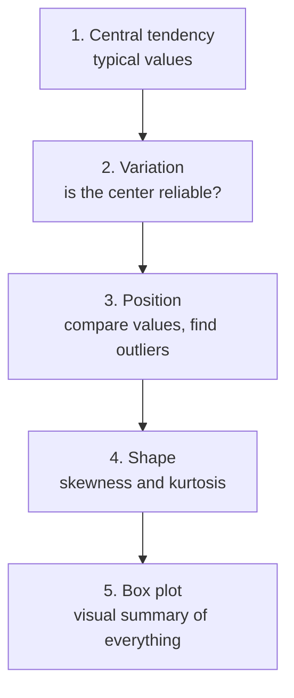
```mermaid
flowchart TD
    A["1. Central tendency<br/>typical values"] --> B["2. Variation<br/>is the center reliable?"]
    B --> C["3. Position<br/>compare values, find outliers"]
    C --> D["4. Shape<br/>skewness and kurtosis"]
    D --> E["5. Box plot<br/>visual summary of everything"]
```

**Example use cases**

- **Data quality check.** The dataset shows mean age 35, SD 8, but the customer base is known to be mostly retirees averaging 62. Conclusion: data problem, fix the source before modeling.
- **Comparing groups.** Retained customers: mean age 38.5, SD 9. Cancelled customers: mean age 34.0. Age may affect cancellation; this must be tested with a hypothesis test (Diagnostic stage).
- **Model preparation.** Income: high variation, good for learning. Education: very low variation, may add little. Plan type: moderate variation, a useful feature.

**Principles**

1. Always interpret, never just calculate.
2. Connect measures: a mean without SD is incomplete; Q1 and Q3 need IQR for context.
3. Context matters: an SD of 50 means different things for a mean of 200 versus 2,000.
4. Visualize when possible: box plots reveal patterns numbers hide.
5. Consider outliers: they may be errors or important insights.

| Mistake | Correct practice |
|---|---|
| Using only the mean for skewed data | Use the median |
| Ignoring outliers | Investigate why they exist |
| Comparing SDs across different scales | Use the coefficient of variation |
| Assuming a symmetric distribution | Check skewness first |

---

# Part 3: FOUNDATION: PROBABILITY AND DISTRIBUTIONS

This bridge part supports Diagnostic (p-values), Predictive (classification) and Prescriptive (expected value).

## 3.1 What is probability?

**Probability** is a number that measures the chance or likelihood of an event occurring (probability = chance = opportunity).

Examples: a delivery arrives late 20% of the time (0.2); a fair 8-sided die shows 8 with probability 1/8 = 12.5%; rain tomorrow 30% (0.3).

```text
Percentage / 100 = Probability
80% = 0.8      50% = 0.5      5% = 0.05
```

Percentage and probability are the same idea in different formats.

## 3.2 Core vocabulary

**Probability experiment:** a procedure that (1) can produce more than one outcome, and (2) whose result cannot be predicted beforehand.

| Procedure | Outcomes | Probability experiment? |
|---|---|---|
| Drawing a card from a shuffled deck | 52 cards | Yes |
| The next customer's payment method | Card, wallet, cash, transfer | Yes |
| Water boiling at 100 C at sea level | Boils | No, single certain outcome |
| Computing 5 + 3 | 8 | No, deterministic |

**Outcome:** the result when the experiment is conducted **once** (for example, rolling a 6 gives outcome 6).

**Sample space (Omega):** the **set of all possible outcomes**.

| Experiment | Sample space |
|---|---|
| Roll an 8-sided die | {1, 2, 3, 4, 5, 6, 7, 8} |
| Spin a wheel with red, blue, green | {Red, Blue, Green} |
| Two orders, each On time (O) or Late (L) | {OO, OL, LO, LL} |
| Yes/No survey answer | {Yes, No} |

**Event:** a **subset** of the sample space, made of outcomes that share a characteristic. All elements must belong to the sample space.

Rolling an 8-sided die once (Omega = {1, ..., 8}):

| Event | Definition | Elements |
|---|---|---|
| E1 | Prime number | {2, 3, 5, 7} |
| E2 | Greater than 6 | {7, 8} |
| E3 | Less than 9 | {1, ..., 8} = Omega |
| E4 | Greater than 8 | { } = empty set |

## 3.3 Special events

| Event type | Elements | Probability | Example (8-sided die) |
|---|---|---|---|
| Certain | E = Omega | P(E) = 1 | Number less than 9 |
| Impossible | E = empty set | P(E) = 0 | Number greater than 8 |
| Regular | Partly inside Omega | Between 0 and 1 | Even number |

## 3.4 Event operations

| Operation | Symbol | Meaning | Both required? |
|---|---|---|---|
| Complement | E' | NOT E: everything in Omega that is not in E | Not applicable |
| Intersection | E ∩ F | E AND F: elements in both | Yes, both conditions must hold |
| Union | E ∪ F | E OR F OR both | No, at least one |

```text
Sample space split by membership in E and F:

     E only        E and F        F only        neither
+-------------+-------------+-------------+-------------+
|   E only    |   E ∩ F     |   F only    |   outside   |
+-------------+-------------+-------------+-------------+

Complement E'  : every region except those inside E
Intersection   : the "E and F" region only
Union          : "E only" + "E and F" + "F only"
```

- Intersection example: a customer is on the Premium plan (E) AND older than 40 (F). Both must be true.
- Union example: a customer is a student (E) OR a senior (F) OR both. Any one qualifies.
- The intersection symbol means "AND" (both events happening together), not "shared elements" in a loose sense.

## 3.5 Classical probability

Probability by **counting**:

```text
P(E) = n(E) / n(Omega)
```

- Requires knowing the whole sample space and uses counting techniques (permutations, combinations, fundamental counting principle).
- Not practical for complex experiments.

**Properties**

| Property | Statement |
|---|---|
| Range | 0 ≤ P(E) ≤ 1 (since n(E) ≤ n(Omega)) |
| Impossible event | If E is empty, P(E) = 0 |
| Certain event | If E = Omega, P(E) = 1 |
| Complement rule | P(E) + P(E') = 1, so P(E') = 1 - P(E) |
| Sum of outcomes | P(O1) + ... + P(On) = 1 |
| Addition rule | P(E or F) = P(E) + P(F) - P(E and F) |

**Example: fair 8-sided die** (n(Omega) = 8)

- P(multiple of 3) = {3, 6}, so 2/8 = 0.25.
- P(greater than 6) = {7, 8}, so 2/8.
- P(less than 9) = 8/8 = 1 (certain).
- P(greater than 8) = 0/8 = 0 (impossible).

## 3.6 Empirical probability

Probability from **observed frequencies**:

```text
P(E) = f / n        f = frequency of E, n = total observations
```

**This is the one used most in data science:** it works with real data, actual observations, frequency tables and datasets.

| Classical | Empirical |
|---|---|
| Based on counting | Based on observed frequency |
| Uses the sample space | Uses data |
| Theoretical | Observed |
| n(E) / n(Omega) | f / n |

**Example:** commute mode of 200 employees.

| Mode | Frequency | Probability |
|---|---|---|
| Car | 80 | 0.40 |
| Bus | 50 | 0.25 |
| Bike | 40 | 0.20 |
| Walk | 30 | 0.15 |
| **Total** | **200** | **1.00** |

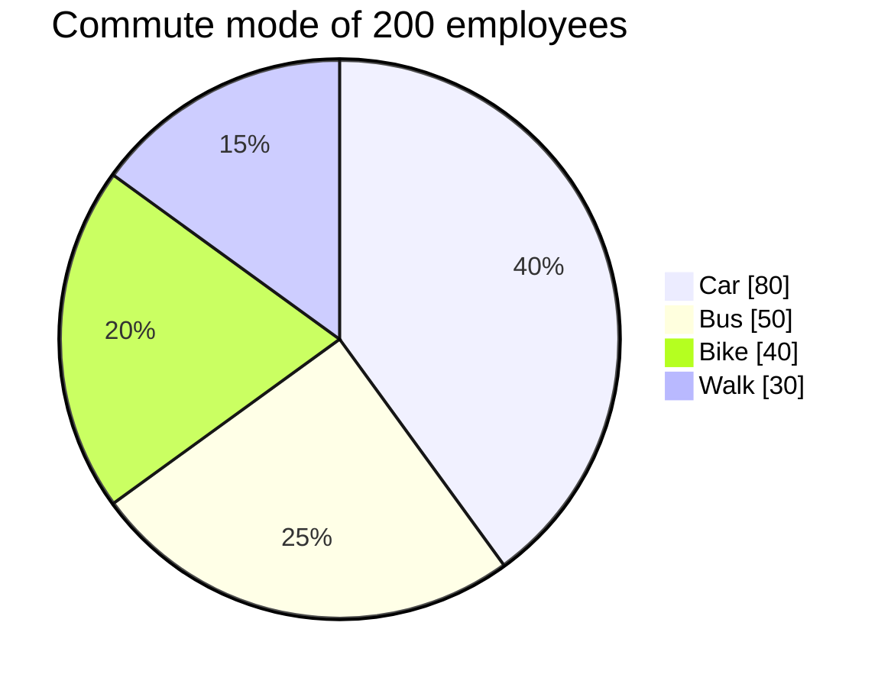
```mermaid
pie showData
    title Commute mode of 200 employees
    "Car" : 80
    "Bus" : 50
    "Bike" : 40
    "Walk" : 30
```

| Question | Working | Answer |
|---|---|---|
| P(Bus) | 50 / 200 | 0.25 |
| P(Bus or Bike) | (50 + 40) / 200 | 0.45 |
| P(not Car and not Walk), direct | P(Bus or Bike) | 0.45 |
| P(not Car and not Walk), by complement | 1 - P(Car or Walk) = 1 - 0.55 | 0.45 |
| P(not Bike) | 1 - 0.20 | 0.80 |

**Population percentage equals individual probability.** If 30% of adults in a city commute by bike, a randomly chosen adult has P(bike) = 0.30. This lets us compute group probabilities.

**Other interpretation:** subjective probability is a personal degree of belief; Bayesian methods formalize how such beliefs update with data.

## 3.7 The complement rule

"NOT E" means everything else in Omega, so **P(E') = 1 - P(E)**. Instead of computing a hard probability directly, compute its complement.

Example: P(order ships from the EU warehouse) = 0.4, so P(does not) = 1 - 0.4 = 0.6.

**Complement is not the same as opposite**

| Event | Complement (correct) | Opposite (wrong) |
|---|---|---|
| Team wins | Lose or Draw | Lose only |
| Traffic light is green | Yellow or Red | Red only |
| Blood type A | B, AB, O | O only |

## 3.8 Independent versus dependent events

**Independent events:** one event does not change the probability of the other. Then P(E given F) = P(E), and **P(E and F) = P(E) x P(F)**.

| Event 1 | Event 2 | Independent? |
|---|---|---|
| Spin a wheel | Roll a die | Yes |
| A customer signs up today | It rains in a distant city | Yes |
| Draw a card with replacement | Draw the second card | Yes |
| Shoe size | Intelligence | Yes |

**Dependent events:** one event changes the probability of the other.

| Event 1 | Event 2 | Why dependent |
|---|---|---|
| Company goes bankrupt | Employee receives salary | Bankruptcy affects pay |
| Draw a card without replacement | Draw the second card | Sample space changes |
| Driving on ice | Car accident | Ice raises accident probability |
| Smoking | Lung disease | Smoking raises risk |

**Bag example: replacement matters.** A bag holds 8 marbles: 5 blue and 3 yellow.

| Scenario | Probabilities on draw 2 | Type |
|---|---|---|
| With replacement | Always P(Blue) = 5/8, P(Yellow) = 3/8 | Independent |
| Without replacement, first was blue | P(Yellow) = 3/7, P(Blue) = 4/7 | Dependent |
| Without replacement, first was yellow | P(Yellow) = 2/7, P(Blue) = 5/7 | Dependent |

**Multiplication rules**

| Case | Rule | Example |
|---|---|---|
| Independent | P(E and F) = P(E) x P(F) | Wheel lands red (1/4) and die shows 5 (1/6): 1/24 |
| Dependent | P(E and F) = P(E) x P(F given E) | Blue then yellow without replacement: 5/8 x 3/7 = 15/56 |

**Survey example:** 30% of adults in a city commute by bike. Pick 3 at random (independent): P(all 3 bike) = 0.3 x 0.3 x 0.3 = 0.027 (2.7%).

**Independence check**

| If | Then events are |
|---|---|
| P(E given F) = P(E) | Independent |
| P(E given F) differs from P(E) | Dependent |
| P(E and F) = P(E) x P(F) | Independent |
| P(E and F) differs from P(E) x P(F) | Dependent |

**Mutually exclusive versus independent:** mutually exclusive events cannot occur together (P(E and F) = 0). If both have positive probability, they are dependent, because knowing one occurred rules out the other.

## 3.9 Conditional probability

The probability of B **given that** A has occurred.

```text
P(B given A) = P(A and B) / P(A)          requires P(A) > 0
```

**Key insight:** the condition shrinks the sample space to A.

```text
Before knowing A (divide by everything)     After knowing A (divide by A only)
   P(B) = n(B) / n(Omega)                      P(B given A) = n(A and B) / n(A)
```

- Conditional probability is called the **backbone of data science**: it uses prior knowledge, handles uncertainty, and lets us make predictions under conditions.
- If A and B are independent, then **P(B given A) = P(B)**.
- Useful identity: **P(A and B) = P(A) x P(B given A) = P(B) x P(A given B)**.

**Worked examples**

- **Independent draws.** A box holds cards numbered 1 to 5. Draw two with replacement. P(second odd given first odd) = P(second odd) = 3/5.
- **Dependent draws.** A drawer holds 6 black socks and 4 white socks. Draw two without replacement. After a black sock is removed, 9 remain (5 black, 4 white), so P(2nd white given 1st black) = 4/9. P(black then white) = 6/10 x 4/9 = 24/90.

**Easy direction versus hard direction**

| Domain | Easy (forward) | Hard (reverse, what we need) |
|---|---|---|
| Medical | P(fever given flu): known from studies | P(flu given fever): needed for diagnosis |
| Email | P(word "free" given spam): easy to count | P(spam given word "free"): what a filter needs |
| Marketing | P(click given interested) | P(interested given click) |

In data science we usually need the **reverse** direction. Bayes' theorem solves this.

## 3.10 Tree diagrams

Used for **sequential experiments** where events depend on earlier outcomes and probabilities change at each stage.

- Rule 1: **multiply along branches** to get joint probabilities.
- Rule 2: **add across branches** to get total probability.

Example: choose 2 people from a project team of 10 (7 engineers, 3 designers) without replacement.

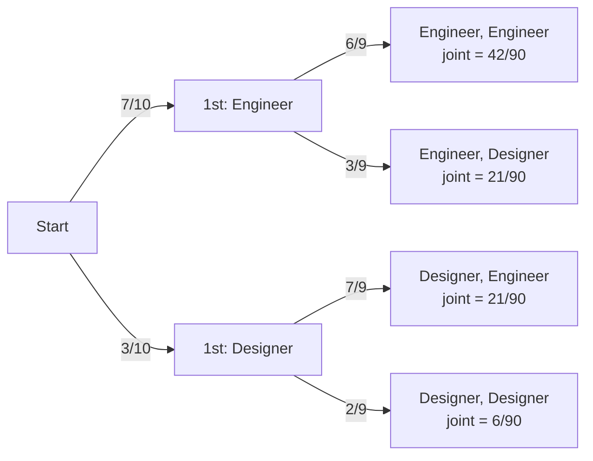
```mermaid
flowchart LR
    S["Start"] -->|"7/10"| E1["1st: Engineer"]
    S -->|"3/10"| D1["1st: Designer"]
    E1 -->|"6/9"| EE["Engineer, Engineer<br/>joint = 42/90"]
    E1 -->|"3/9"| ED["Engineer, Designer<br/>joint = 21/90"]
    D1 -->|"7/9"| DE["Designer, Engineer<br/>joint = 21/90"]
    D1 -->|"2/9"| DD["Designer, Designer<br/>joint = 6/90"]
```

| First | P(first) | Second | P(second given first) | Joint |
|---|---|---|---|---|
| Engineer | 7/10 | Engineer | 6/9 | 42/90 |
| Engineer | 7/10 | Designer | 3/9 | 21/90 |
| Designer | 3/10 | Engineer | 7/9 | 21/90 |
| Designer | 3/10 | Designer | 2/9 | 6/90 |
| **Total** | | | | **90/90 = 1** |

P(at least one designer) = 1 - 42/90 = 48/90 = 0.533.

## 3.11 Total probability and Bayes' theorem

**Total probability.** If A1, ..., An partition the sample space:

```text
P(B) = P(B given A1) P(A1) + P(B given A2) P(A2) + ... + P(B given An) P(An)
```

**Bayes' theorem**

```text
P(A given B) = [ P(B given A) x P(A) ] / P(B)
```

- Bayes' theorem is a foundation of data science: it reverses conditional probabilities, updates beliefs with new evidence, and handles uncertainty in classification and prediction.
- **Uncertainty example:** fever can come from flu, a throat infection, COVID-19 or stomach problems, so P(cause given fever) is not obvious.

**Segmentation and prior knowledge.** Each segment acts as a **weight** in the total probability.

| Age group | P(group) | P(disease given group) | Weight in the calculation |
|---|---|---|---|
| 10 to 20 | Low | Very low | Small influence |
| 20 to 40 | Medium | Low | Medium |
| 40 to 60 | Medium | Medium | Medium |
| 60 and above | High | High | Large influence |

**Worked example 1: two bins.** A die decides the bin. Roll 1 or 2: Bin A (3 faulty, 12 fine, 15 total). Roll 3 to 6: Bin B (2 faulty, 2 fine, 4 total).

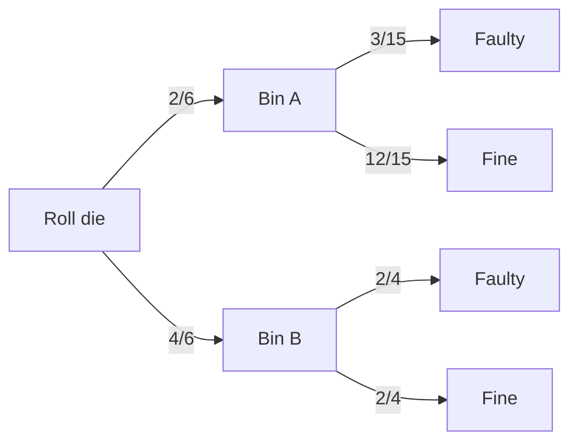
```mermaid
flowchart LR
    S["Roll die"] -->|"2/6"| A["Bin A"]
    S -->|"4/6"| B["Bin B"]
    A -->|"3/15"| AF["Faulty"]
    A -->|"12/15"| AN["Fine"]
    B -->|"2/4"| BF["Faulty"]
    B -->|"2/4"| BN["Fine"]
```

P(Faulty) = (2/6)(3/15) + (4/6)(2/4) = 0.0667 + 0.3333 = **0.40**.

**Worked example 2: three battery factories**

| Factory | Share of output | Defect rate |
|---|---|---|
| X | 40% | 2% |
| Y | 35% | 3% |
| Z | 25% | 6% |

Part A: P(defective) = 0.40 x 0.02 + 0.35 x 0.03 + 0.25 x 0.06 = 0.008 + 0.0105 + 0.015 = **0.0335 (3.35%)**.

Part B: given a defective battery, which factory made it?

| Factory | P(factory) x P(defective given factory) | P(factory given defective) |
|---|---|---|
| X | 0.008 | 0.008 / 0.0335 = 23.9% |
| Y | 0.0105 | 31.3% |
| Z | 0.015 | 44.8% |
| Total | 0.0335 | 100% |

**Interpretation:** factory Z has the highest defect rate (6%) and, with a 25% share, contributes the most defects (44.8%). A factory with a low rate but a big share can still matter, and vice versa. Volume is the weight.

**Worked example 3: spam filter.** P(spam) = 0.30. P("free" given spam) = 0.60. P("free" given not spam) = 0.05.

- P("free") = 0.30 x 0.60 + 0.70 x 0.05 = 0.18 + 0.035 = 0.215.
- P(spam given "free") = 0.18 / 0.215 = **0.837**.

## 3.12 Common probability mistakes

| Mistake | Correction |
|---|---|
| Treating the complement as the "opposite" | The complement is all other outcomes |
| Adding overlapping events | Subtract the overlap: P(E or F) = P(E) + P(F) - P(E and F). Example on an 8-sided die: even = {2,4,6,8}, greater than 3 = {4,5,6,7,8}, both = {4,6,8}, so P = 4/8 + 5/8 - 3/8 = 6/8 |
| Treating dependent draws as independent | Update the sample space after each draw |
| Probability outside 0 to 1 | Calculation error |
| Dividing by zero in conditional probability | Ensure P(A) is greater than 0 |
| Confusing intersection with a loose "shared" idea | Intersection means AND |
| Ignoring sampling without replacement | Probabilities change after each draw |
| Skipping segmentation | Use it when segments behave differently |

## 3.13 Where each probability type is used in data science

| Type | Where |
|---|---|
| Classical | Naive Bayes foundations, theoretical models, simulation |
| Empirical (most common) | Data-driven models, frequency and contingency tables, real datasets |
| Conditional and Bayes | Bayesian methods, diagnostic models, recommendation systems, classification, NLP |

Classification asks for P(Category given Features): P(spam given text), P(fraud given transaction pattern), P(disease given symptoms).

**Bridge to advanced topics:** Bayes' theorem, Naive Bayes classifier, Bayesian networks, association rules (market basket analysis).

## 3.14 Random variables and probability distributions

**Evolution of thinking**

```text
Traditional:  Experiment -> Sample space -> Count outcomes -> Probability
Modern:       Experiment -> Random variable -> Distribution function -> Direct probability
```

**Problem:** functions need numbers, but sample spaces contain words. **Solution:** a **random variable**.

A **probability distribution** is a function that calculates probabilities directly, without listing the entire sample space.

**Random variable (X):** a function that converts sample-space outcomes into numbers according to the characteristic the researcher cares about.

| Component | Description |
|---|---|
| Domain | Sample space |
| Range | A subset of the real numbers |
| Transformation | Based on the researcher's interest |

Example: two orders, X = number of late orders.

| Outcome | X |
|---|---|
| OO | 0 |
| OL | 1 |
| LO | 1 |
| LL | 2 |

**Types**

| Type | Definition | Example |
|---|---|---|
| Discrete | Countable values | Number of late orders, number of tickets |
| Continuous | Any value in an interval | Height, weight, delivery time |

The type decides which distribution to use.

**Distribution of the example.** If each order is late with probability 0.2 (independent):

| X | 0 | 1 | 2 |
|---|---|---|---|
| P(X) | 0.64 | 0.32 | 0.04 |

**Expected value and variance**

- **E(X) = sum of x times P(x)** = 0(0.64) + 1(0.32) + 2(0.04) = **0.40** late orders on average.
- **Var(X) = E(X squared) - E(X) squared** = 0.48 - 0.16 = **0.32**.

**Key distributions**

| Distribution | Type | Use | Parameters | Example |
|---|---|---|---|---|
| Bernoulli | Discrete | One yes/no trial | p | One order is late or not |
| Binomial | Discrete | Number of successes in n independent trials | n, p | 5 orders, p = 0.2: P(exactly 2 late) = 10 x 0.04 x 0.512 = 0.205 |
| Poisson | Discrete | Number of events in a fixed interval | lambda | Support tickets per hour with lambda = 3: P(0) = 0.050; P(5) = 0.101 |
| Uniform | Continuous | All values equally likely | a, b | Random arrival within an hour |
| Normal | Continuous | Bell-shaped, natural variation | mu, sigma | Delivery time, measurement error |
| t | Continuous | Small-sample means | Degrees of freedom | t-tests |
| Chi-square | Continuous | Variances, categorical tests | Degrees of freedom | Chi-square tests |

Binomial: mean = np, variance = np(1 - p). Poisson: mean = variance = lambda.

## 3.15 Normal distribution

- The most famous continuous distribution: bell-shaped, symmetric around the mean, with two parameters (mean mu and standard deviation sigma).
- Many natural phenomena are approximately normal; it underlies many statistical tests and regression analysis.

```text
              ***
            *     *
          *         *
        *             *
    ***                 ***
 ______________________________
   mu-2s   mu-s   mu   mu+s   mu+2s
```

- **Standard normal:** z = (x - mu) / sigma has mean 0 and SD 1.
- Example: delivery time is normal with mean 30 and SD 5. P(25 < X < 35) is about 68%. A delivery of 40 minutes has z = 2, roughly the 97.7th percentile.

**Central limit theorem.** The distribution of sample means approaches a normal distribution as the sample size grows (roughly n of 30 or more), regardless of the original distribution. This is why many tests work on means.

**Standard error and confidence intervals**

| Concept | Formula | Meaning |
|---|---|---|
| Standard error of the mean | SE = s / sqrt(n) | Typical error of a sample mean |
| 95% confidence interval | mean +/- about 1.96 x SE (large n) | Range of plausible population means |

Example: n = 100, mean = 30.4, s = 5, so SE = 0.5 and the 95% CI is 30.4 +/- 0.98, i.e. (29.4, 31.4).

---

# Part 4: DIAGNOSTIC ANALYTICS

```text
Descriptive  ->  Diagnostic  ->  Predictive   ->  Prescriptive
  (What?)         (Why?)        (What will?)     (What should?)
```

Diagnostic analytics identifies **why** something happened. Topics: hypothesis testing, t-tests (difference between means), proportion tests, homogeneity and independence tests, chi-square tests, correlation, association.

## 4.1 What is hypothesis testing?

A **hypothesis** is an assumption or claim that can be tested.

Example claims:

- "Extending packing-line hours will reduce wasted materials."
- "Airbags reduce injury severity in collisions."
- "Warehouse location affects delivery driver pay."

Two possible outcomes:

| Outcome | Meaning |
|---|---|
| Accept | The hypothesis is supported by the evidence |
| Reject | The hypothesis is not supported by the evidence |

Technical note: strictly, we "fail to reject" H0 rather than prove it true; the notes use "accept" for simplicity.

## 4.2 Motivating example: driver pay

**HR claim:** "Whether a driver works in the Denver depot or the Atlanta depot affects their pay."

Data science use: a predictive model of pay offers with features such as location, experience and vehicle type. The question: does location **significantly** affect pay?

| If significant | If not significant |
|---|---|
| Include location in the model; offer different pay by depot | Remove location; simplify the model |

We are not asking "is there a difference?" but "is there a **meaningful** difference?"

**Information required:** mean pay in each depot, sample sizes and standard deviations. **Population:** the entire group being studied (all drivers).

## 4.3 Understanding "significant"

**The delivery-delay story.** A courier arrives 3 minutes later than another. Is the 3-minute difference significant?

| Context | Does 3 minutes matter? | Significant? |
|---|---|---|
| Delivering a parcel booked for "sometime today" | Both couriers accomplish the task | No |
| Delivering a defibrillator to an emergency | The later courier may miss the window | Yes |

**Lesson:** "significant" means the difference is important enough to affect the outcome in a given context. Statistically, the p-value provides that judgement using the data's variation.

## 4.4 Significance level (alpha), confidence and p-value

**Alpha (significance level):** the maximum probability of making an error that we are willing to accept.

| Alpha | Error tolerance | Confidence level |
|---|---|---|
| 0.10 | 10% | 90% |
| 0.05 | 5% | 95% |
| 0.01 | 1% | 99% |

**Importance-level interpretation.** With alpha = 0.05 we need 95% confidence that the difference is important. Software often shows **Importance = 1 - p-value**.

Example: p = 0.02 gives importance 0.98, read as "98% confident the difference is important." (Caution: this is a practical reading aid, not a formal probability that H0 is false. Formally, the p-value is the probability of seeing data at least this extreme if H0 were true.)

**P-value:** the calculated value that drives the decision.

```text
p-value ≤ alpha   ->   REJECT H0   ->   difference IS significant
p-value > alpha   ->   ACCEPT H0   ->   difference is NOT significant
```

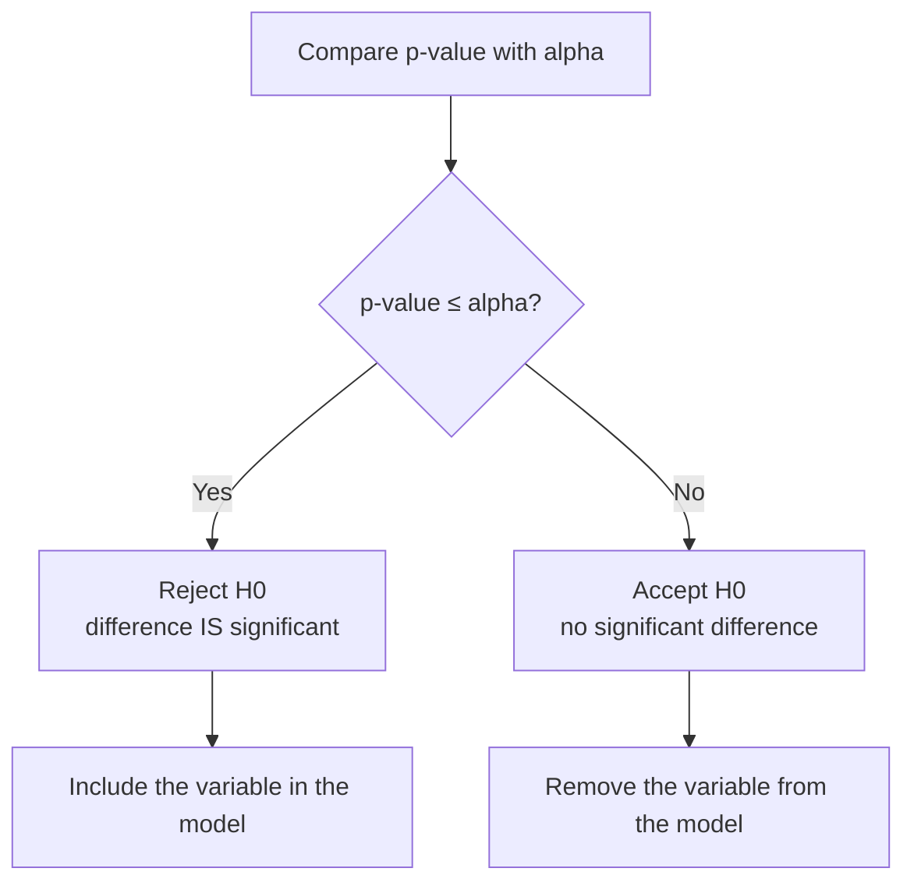
```mermaid
flowchart TD
    C["Compare p-value with alpha"] --> Y{"p-value ≤ alpha?"}
    Y -->|Yes| R["Reject H0<br/>difference IS significant"]
    Y -->|No| A["Accept H0<br/>no significant difference"]
    R --> I["Include the variable in the model"]
    A --> X["Remove the variable from the model"]
```

## 4.5 The two hypotheses

| Hypothesis | Symbol | Meaning | Uses |
|---|---|---|---|
| Null | H0 | There is NO significant difference | Always an equals sign |
| Alternative | H1 | There IS a significant difference | Not equal, greater than, or less than |

```text
H0: mu_Denver = mu_Atlanta        (mean pay is the same)
H1: mu_Denver ≠ mu_Atlanta        (mean pay differs)
```

**Tails:** "not equal" is a two-tailed test; "greater than" or "less than" is one-tailed.

**Errors and power**

| Reality | Reject H0 | Do not reject H0 |
|---|---|---|
| H0 is true | Type I error (false positive), probability alpha | Correct |
| H0 is false | Correct (power = 1 - beta) | Type II error (false negative), probability beta |

This matches the confusion matrix in Part 5: a false positive is a Type I error and a false negative is a Type II error.

**Steps of a hypothesis test**

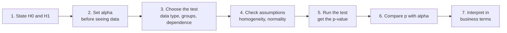
```mermaid
flowchart LR
    A["1. State H0 and H1"] --> B["2. Set alpha<br/>before seeing data"]
    B --> C["3. Choose the test<br/>data type, groups, dependence"]
    C --> D["4. Check assumptions<br/>homogeneity, normality"]
    D --> E["5. Run the test<br/>get the p-value"]
    E --> F["6. Compare p with alpha"]
    F --> G["7. Interpret in<br/>business terms"]
```

## 4.6 Types of hypothesis tests

| Test | When to use | Example |
|---|---|---|
| Difference between 2 means (independent) | Two separate groups | iOS versus Android app spending |
| Difference between 2 means (dependent) | Same subjects measured twice | Store sales before and after a redesign |
| Difference in proportions | Compare percentages | Email variant A versus B open rates |
| Chi-square (homogeneity or independence) | Distributions of categories | Plan preference by customer segment |
| Variance equality | Homogeneity check | Response time consistency of two servers |

## 4.7 Test 1: difference between two means (independent samples)

**Use when:** two separate, unrelated groups; one group does not affect the other.

**Question:** "Does the mobile operating system significantly affect weekly grocery spending in an app?" Is average spending by iOS users different from Android users, and is the difference meaningful?

```text
H0: mu_iOS = mu_Android        H1: mu_iOS ≠ mu_Android
alpha = 0.05 (need 95% confidence)
```

Given: mean, sample size and SD for each group.

| Group | n | Mean | SD |
|---|---|---|---|
| iOS | 150 | $92 | $25 |
| Android | 150 | $88 | $25 |

Software output: difference = $4; SE = 25 x sqrt(2/150) = 2.89; t = 1.39; **p is about 0.17**.

```text
p (0.17) > alpha (0.05)   ->   ACCEPT H0   ->   no significant difference
-> the operating system is not important for this spending model
```

**Interpretation:** there IS a $4 difference in the sample, but it is not statistically significant. The variable can be removed from the spending model.

**Real-world context:** in shared-household accounts, the registered user is often not the actual buyer, which blurs the platform effect.

**Effect size:** Cohen's d = 4 / 25 = 0.16 (small). With very large samples even tiny differences become significant, so always check practical importance.

## 4.8 Test 2: difference between two means (dependent samples)

**Use when:** the same group is measured twice (before and after); groups are dependent.

Common scenarios: blood pressure before and after treatment, employee performance before and after training, sales of the same stores before and after a change.

**Key identifier:** look for "before and after", "pre and post", "same subjects measured twice".

**Question:** "Did the new store layout significantly increase weekly sales?"

| Store | Before (thousand) | After (thousand) | Difference |
|---|---|---|---|
| S1 | 40 | 46 | +6 |
| S2 | 55 | 58 | +3 |
| S3 | 32 | 39 | +7 |
| S4 | 60 | 61 | +1 |
| S5 | 45 | 52 | +7 |
| S6 | 38 | 44 | +6 |

```text
H0: mu_before = mu_after       H1: mu_before ≠ mu_after
Mean difference = 5.0;  SD of differences = 2.45;  SE = 1.0
t = 5.0 with 5 degrees of freedom;  p is about 0.004
p < 0.05  ->  REJECT H0  ->  the layout change had a significant effect
```

| If the difference IS significant | If NOT significant |
|---|---|
| The change is effective; continue the strategy; keep "period" as a model feature | The change had no meaningful impact; try new strategies; drop the feature |

Use the **paired t-test** here (not the independent one), because the same stores appear twice.

## 4.9 Test 3: difference in proportions

**Use when:** comparing percentages between groups; categorical outcomes (yes/no, success/failure, accept/reject).

**Why important: the imbalance problem.** Predicting churn with a dataset of 92% retained and 8% churned can bias a model toward the majority class. Question: is the proportion difference significant enough to cause problems (need to balance data or build separate models)?

**Example: email variants**

| Variant | Sent | Opened | Open rate |
|---|---|---|---|
| A | 400 | 120 | 30% |
| B | 400 | 156 | 39% |

```text
H0: p_A = p_B        H1: p_A ≠ p_B
Pooled p = 276 / 800 = 0.345;  SE = 0.0336;  z = 0.09 / 0.0336 = 2.68;  p is about 0.007
```

**Decision cases**

| Case | p-value | Decision | Consequence |
|---|---|---|---|
| 1 | 0.08 | p is above 0.05: accept H0 | Proportions not significantly different; no need to balance or split |
| 2 | 0.02 | p is 0.05 or below: reject H0 | Proportions differ; consider balancing or separate models |
| Email example | 0.007 | Reject H0 | Variant B is significantly better |

Importance score: if p = 0.02, importance = 1 - 0.02 = 98% ("98% confident the difference is important").

## 4.10 Parametric versus non-parametric methods

> Using the wrong test type is like measuring a room with a ruler marked in inches while recording the result as centimeters: the process looks right but the answer is invalid.

| Category | Requirements | Examples |
|---|---|---|
| Parametric | Data must be homogeneous (and roughly normal) | t-tests, ANOVA, linear regression |
| Non-parametric | No homogeneity or normality required | Mann-Whitney U, Kruskal-Wallis |

**Test equivalents**

| Parametric | Non-parametric counterpart | Use |
|---|---|---|
| Independent t-test | Mann-Whitney U | 2 independent groups |
| Paired t-test | Wilcoxon signed-rank | 2 dependent groups |
| One-way ANOVA | Kruskal-Wallis | 3 or more groups |
| Pearson correlation | Spearman correlation | Association of two variables |

**Parametric machine learning algorithms**

- Definition: the **number of parameters is fixed** regardless of data size.
- Example: simple linear regression `y = b0 + b1 x` always has 2 parameters (an intercept and a slope). More data changes their values but not their number.
- Examples: linear regression, logistic regression, Naive Bayes, perceptron, linear discriminant analysis (LDA).

**Non-parametric machine learning algorithms**

- Definition: **parameters grow as data grows**; flexible.
- Example: decision tree. More data allows deeper trees and more splits.

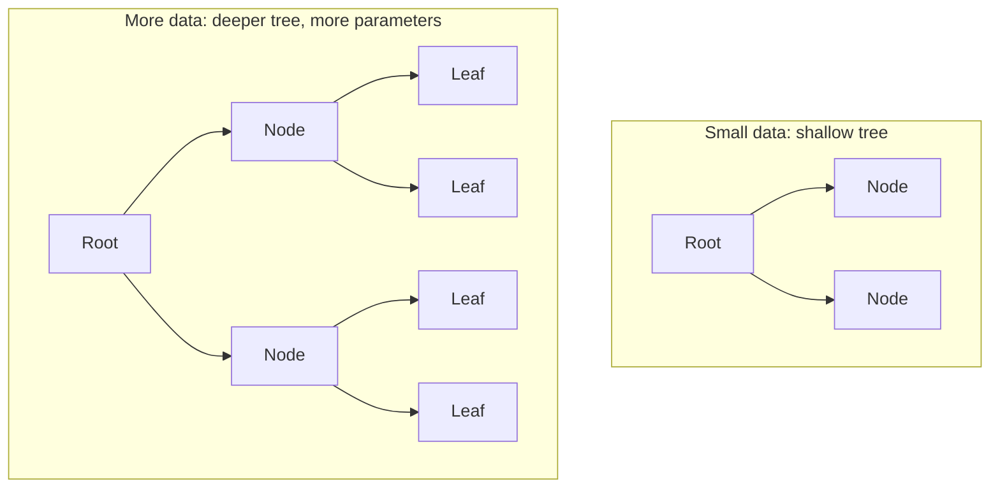
```mermaid
flowchart TD
    subgraph SMALL["Small data: shallow tree"]
        R1["Root"] --> A1["Node"]
        R1 --> B1["Node"]
    end
    subgraph BIG["More data: deeper tree, more parameters"]
        R2["Root"] --> A2["Node"]
        R2 --> B2["Node"]
        A2 --> C2["Leaf"]
        A2 --> D2["Leaf"]
        B2 --> E2["Leaf"]
        B2 --> F2["Leaf"]
    end
```

- Examples: decision trees, random forest, K-nearest neighbors (KNN), support vector machines (with certain kernels).

**Comparison**

| Parametric advantages | Parametric disadvantages |
|---|---|
| Easy to understand | Limited complexity |
| Fast computation | May underfit complex data |
| Needs less data | Assumes a data distribution |
| Simple interpretation | Sensitive to outliers |

| Non-parametric advantages | Non-parametric disadvantages |
|---|---|
| Very flexible | Requires more data |
| Handles complex data | Slower computation |
| High performance potential | Risk of overfitting |
| Robust to outliers | Hard to interpret |
| No distribution assumptions | Difficult for real-time use |

**Algorithm classification (as taught in the notes)**

| Algorithm | Type | Notes |
|---|---|---|
| Random forest | Non-parametric | Tree-based |
| Decision tree | Non-parametric | Single tree |
| Classification tree | Non-parametric | For categories |
| Regression tree | Non-parametric | For numbers |
| Linear regression | Parametric | Fixed parameters |
| Logistic regression | Parametric | Fixed parameters |
| Naive Bayes | Parametric | Probability-based |
| Maximum likelihood | Listed as non-parametric in the notes | For small samples |
| KNN | Non-parametric | Distance-based |
| K-means | Listed as non-parametric in the notes | Clustering |

Clarification: maximum likelihood is an estimation method normally applied to parametric models, and K-means uses a fixed number of centroids, so many textbooks classify them differently. Treat the table as course convention and verify against your reference.

**Rules of thumb**

- Small dataset: the notes recommend non-parametric methods (they make fewer distribution assumptions), though parametric models need less data to fit stably when their assumptions hold.
- Large dataset: parametric methods are faster.
- Always check whether the data meets parametric assumptions.

## 4.11 Testing for homogeneity

**Homogeneity:** data groups are similar in distribution and variance.

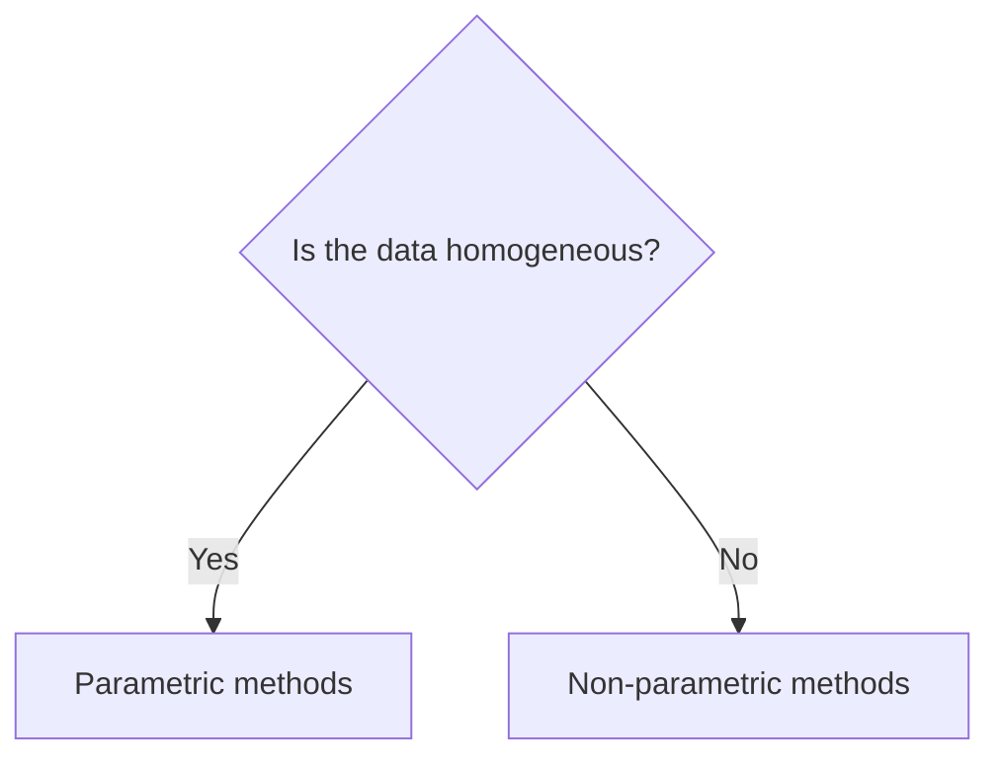
```mermaid
flowchart TD
    H{"Is the data homogeneous?"} -->|Yes| P["Parametric methods"]
    H -->|No| N["Non-parametric methods"]
```

Using parametric methods on non-homogeneous data gives invalid results.

**Quantitative data: variance equality test.** Example: response time (ms) of two server clusters.

```text
H0: variance_A = variance_B    (equal variances: HOMOGENEOUS)
H1: variance_A ≠ variance_B    (NOT homogeneous)

p > alpha   -> accept H0 -> homogeneous     -> parametric methods
p ≤ alpha   -> reject H0 -> not homogeneous -> non-parametric methods
```

Tests: F-test, Levene's test. Welch's t-test is an alternative when variances differ but data is roughly normal; the Shapiro-Wilk test checks normality.

**Categorical data: chi-square test of homogeneity.** Applies to nominal or ordinal data such as gender, eye color, education level, hotel ratings. Question: is the distribution of preferred plan homogeneous across customer segments?

## 4.12 Chi-square test (association or homogeneity for categorical variables)

**Purpose:** determine whether there is a statistically significant association between two categorical variables (or whether distributions are the same across groups).

**Use when:** both variables are nominal, one is nominal and one ordinal, or you are testing whether distributions are similar.

**Worked example: customer segment by preferred plan**

Observed counts:

| Segment | Basic | Standard | Premium | Total |
|---|---|---|---|---|
| Student | 30 | 20 | 10 | 60 |
| Professional | 25 | 45 | 30 | 100 |
| **Total** | **55** | **65** | **40** | **160** |

```text
H0: No association between segment and plan (same distribution; homogeneous)
H1: Association exists (different distributions; not homogeneous)
```

Expected count = (row total x column total) / grand total:

| Segment | Basic | Standard | Premium |
|---|---|---|---|
| Student | 20.6 | 24.4 | 15.0 |
| Professional | 34.4 | 40.6 | 25.0 |

Chi-square = sum of (observed - expected) squared, divided by expected = 4.26 + 0.79 + 1.67 + 2.56 + 0.47 + 1.00, which is about **10.74**. Degrees of freedom = (2 - 1)(3 - 1) = 2. **p is about 0.005**.

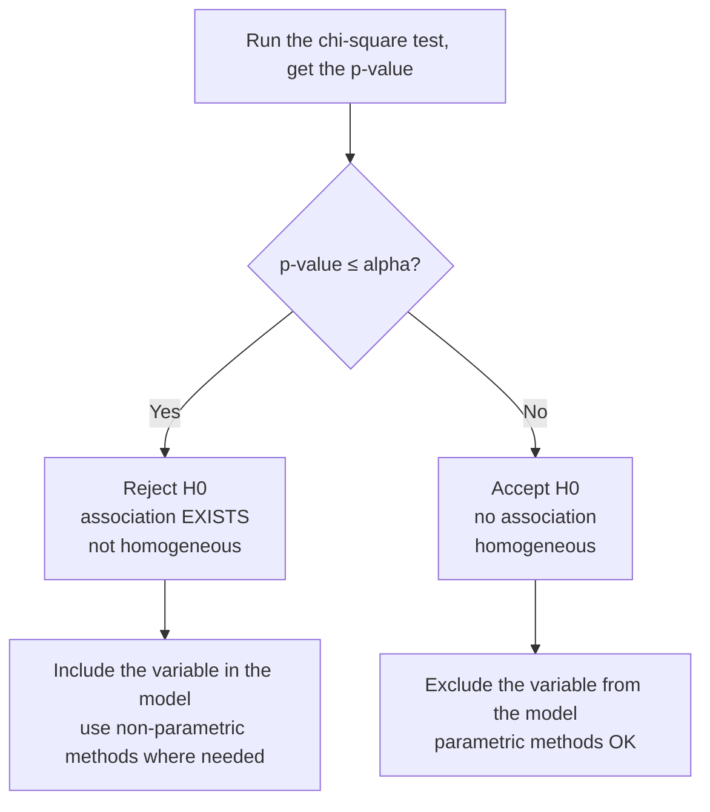
```mermaid
flowchart TD
    R["Run the chi-square test, get the p-value"] --> D{"p-value ≤ alpha?"}
    D -->|Yes| X["Reject H0<br/>association EXISTS<br/>not homogeneous"]
    D -->|No| Y["Accept H0<br/>no association<br/>homogeneous"]
    X --> I["Include the variable in the model<br/>use non-parametric methods where needed"]
    Y --> E["Exclude the variable from the model<br/>parametric methods OK"]
```

**Conclusion:** plan preference depends on segment. **Assumption:** expected counts should generally be at least 5 per cell.

**Strength of association: Cramer's V** = sqrt(chi-square / (n x min(rows - 1, columns - 1))) = sqrt(10.74 / 160) = **0.26** (weak to moderate).

| Cramer's V | Strength |
|---|---|
| 0.1 | Weak |
| 0.3 | Moderate |
| 0.5 or more | Strong |

## 4.13 Correlation versus association

The two are often translated with the same word ("relationship"), but they are **statistically different**.

**Association**

- General concept: a relationship **exists** between variables.
- Tells you: there is a relationship. Does NOT tell you: type, direction or strength.
- Works with **categorical variables** (nominal or ordinal).
- Example: "There is an association between office lighting color and reported mood." We know they relate, but not how.

**Correlation**

- A **mathematical measure** of **linear relationships**.
- Tells you whether a linear relationship exists, its **strength** and **direction**, as a **numeric value**.
- Works with **quantitative variables** (or ordinal variables converted to numbers).
- Example: correlation between weekly training hours and resting heart rate = -0.80: a strong negative linear relationship.

| Aspect | Association | Correlation |
|---|---|---|
| Type | Concept | Statistical measure |
| Tells us | A relationship exists | Linear relationship details |
| Direction | No | Yes (positive or negative) |
| Strength | No | Yes (0 to ±1) |
| Variables | Categorical | Quantitative or ordinal |
| Output | Yes or no | Numeric coefficient |

**Example: exercise type, training hours, heart rate.** Variables: **exercise type** (running, cycling, swimming, yoga: nominal), **weekly training hours** (numeric), **resting heart rate** (numeric).

| Pair | Can we compute a correlation? | Result |
|---|---|---|
| Exercise type and training hours | No: one categorical, one numeric | Association only |
| Exercise type and resting heart rate | No: one categorical, one numeric | Association only |
| Training hours and resting heart rate | Yes: both quantitative | Correlation: direction, strength and value |

**When to use which**

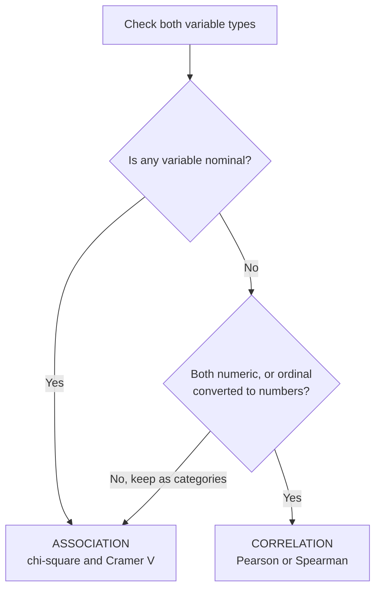
```mermaid
flowchart TD
    A["Check both variable types"] --> B{"Is any variable nominal?"}
    B -->|Yes| AS["ASSOCIATION<br/>chi-square and Cramer V"]
    B -->|No| C{"Both numeric, or ordinal<br/>converted to numbers?"}
    C -->|Yes| CO["CORRELATION<br/>Pearson or Spearman"]
    C -->|No, keep as categories| AS
```

| Variable 1 | Variable 2 | Use |
|---|---|---|
| Quantitative | Quantitative | Correlation |
| Ordinal | Ordinal | Correlation (convert to numbers) |
| Ordinal | Quantitative | Correlation |
| Nominal | Nominal | Association |
| Nominal | Ordinal | Association |
| Nominal | Quantitative | Association |

## 4.14 Pearson correlation coefficient (r)

Determines (1) whether a linear relationship exists, (2) its strength, and (3) its direction.

```text
r = sum[(x - mean_x)(y - mean_y)] / sqrt( sum[(x - mean_x)^2] x sum[(y - mean_y)^2] )
```

**Properties**

| Property | Statement |
|---|---|
| Range | -1 ≤ r ≤ +1. A value outside this range means a calculation error |
| r = 0 | No linear relationship (other relationships, such as quadratic or exponential, may still exist) |
| r above 0 | Positive: as X rises, Y rises; as X falls, Y falls (example: study hours and exam score) |
| r below 0 | Negative: as X rises, Y falls (example: exercise hours and resting heart rate) |
| Strength | The closer the absolute value of r is to 1, the stronger the relationship |

**Strength scale**

| Absolute value of r | If r is positive | If r is negative |
|---|---|---|
| 0.00 | No relationship | No relationship |
| 0.10 to 0.30 | Weak positive | Weak negative |
| 0.40 to 0.60 | Moderate positive | Moderate negative |
| 0.70 to 0.90 | Strong positive | Strong negative |
| 1.00 | Perfect positive | Perfect negative |

**Reading scatter plots**

```text
No linear pattern (r = 0)      Strong positive (r near +0.9)    Strong negative (r near -0.9)
y |   .      .                 y |                  .          y | .
  |       .     .                |              . .              |    . .
  |  .        .                  |          . .                  |        . .
  |      .  .                    |      . .                      |            . .
  |   .                          |  . .                          |                 .
  +------------------ x          +------------------ x          +------------------ x

Perfect positive (r = +1)      Perfect negative (r = -1)
y |                  .          y | .
  |               .               |   .
  |            .                  |      .
  |         .                     |         .
  |      .                        |            .
  +------------------ x          +------------------ x
```

| Pattern | r | Description |
|---|---|---|
| Circle or random scatter | 0 | No linear relationship |
| Horizontal line | 0 | Y does not change with X |
| Slight upward scatter | 0.1 to 0.5 | Weak positive |
| Clear upward trend | 0.6 to 0.8 | Strong positive |
| Perfect upward line | 1.0 | Perfect positive |
| Slight downward scatter | -0.1 to -0.5 | Weak negative |
| Clear downward trend | -0.6 to -0.8 | Strong negative |
| Perfect downward line | -1.0 | Perfect negative |

**Worked example: study hours and exam score**

| Hours (x) | Score (y) |
|---|---|
| 1 | 52 |
| 2 | 58 |
| 3 | 65 |
| 4 | 70 |
| 5 | 80 |

Means: x = 3, y = 65. Sum of cross-products = 68; Sxx = 10; Syy = 468.
**r = 68 / sqrt(10 x 468) = 0.994**, a very strong positive correlation. r squared = 0.988: about 98.8% of the variation in scores is explained linearly by hours.

**Cautions**

- Correlation does not imply causation (a hidden third variable may drive both).
- Pearson is sensitive to outliers and detects only linear patterns.
- **Spearman's rank correlation** suits ordinal data or monotonic non-linear relationships.
- A significance test on r checks H0: no linear relationship in the population.
- A **correlation matrix** and **heat map** summarize many pairs; highly correlated predictors cause **multicollinearity** in regression.

## 4.15 Comparing three or more groups: ANOVA

- One-way ANOVA tests H0: all group means are equal, using the F statistic.
- Example: average delivery time across four regions.
- If significant, follow with post-hoc tests (for example, Tukey) to find which groups differ.
- Non-parametric alternative: Kruskal-Wallis.
- **Multiple comparisons:** running many tests inflates Type I error; use corrections such as Bonferroni (alpha divided by the number of tests).

## 4.16 Complete test-selection workflow

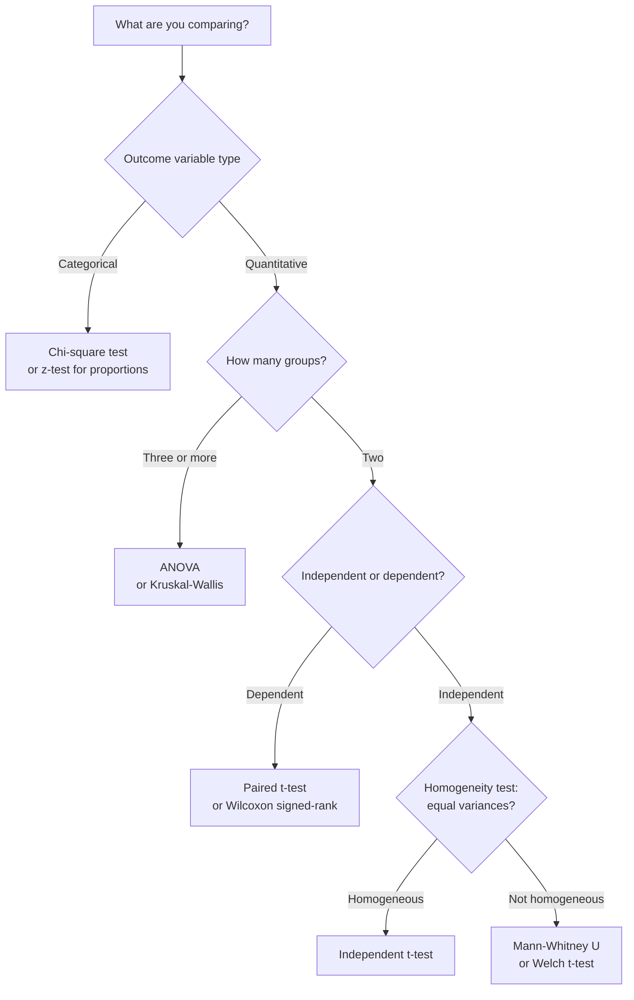
```mermaid
flowchart TD
    S["What are you comparing?"] --> T{"Outcome variable type"}
    T -->|Categorical| C["Chi-square test<br/>or z-test for proportions"]
    T -->|Quantitative| G{"How many groups?"}
    G -->|Three or more| A["ANOVA<br/>or Kruskal-Wallis"]
    G -->|Two| I{"Independent or dependent?"}
    I -->|Dependent| PT["Paired t-test<br/>or Wilcoxon signed-rank"]
    I -->|Independent| HV{"Homogeneity test:<br/>equal variances?"}
    HV -->|Homogeneous| TT["Independent t-test"]
    HV -->|Not homogeneous| MW["Mann-Whitney U<br/>or Welch t-test"]
```

**Test selection guide**

| Scenario | Independent or dependent | Data type | Test |
|---|---|---|---|
| Compare 2 group means | Independent | Quantitative | Independent t-test |
| Compare 2 group means | Dependent | Quantitative | Paired t-test |
| Compare 2 group proportions | Independent | Categorical | z-test for proportions |
| Distribution similarity or association | Independent | Categorical | Chi-square |
| Variance equality | Independent | Quantitative | F-test or Levene's |
| Linear relationship | Paired measurements | Quantitative | Pearson correlation |
| Relationship, ordinal | Paired measurements | Ordinal | Spearman correlation |

**Hypothesis format guide**

| Test | H0 | H1 |
|---|---|---|
| Means (two-tailed) | mu1 = mu2 | mu1 ≠ mu2 |
| Proportions | p1 = p2 | p1 ≠ p2 |
| Variances | variance1 = variance2 | variance1 ≠ variance2 |
| Chi-square | Distributions are the same | Distributions differ |

**Practical software workflow**

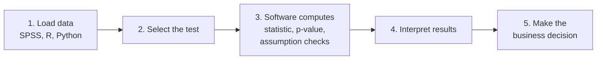
```mermaid
flowchart LR
    A["1. Load data<br/>SPSS, R, Python"] --> B["2. Select the test"]
    B --> C["3. Software computes<br/>statistic, p-value,<br/>assumption checks"]
    C --> D["4. Interpret results"]
    D --> E["5. Make the<br/>business decision"]
```

You do NOT need manual formulas. You DO need: when to use each test, how to read p-values, what results mean for the business, and which assumptions must hold.

## 4.17 Diagnostic best practices

**Critical concepts**

1. A difference is not the same as a **significant** difference; significance depends on context.
2. p-value ≤ alpha means reject H0 (significant); p-value > alpha means accept H0 (not significant).
3. Homogeneity must be tested, not assumed.
4. Parametric: faster, simpler, requires homogeneity. Non-parametric: flexible, always valid, but slower and needs more data.
5. Statistical significance is not the same as practical significance.

| Mistake | Better practice |
|---|---|
| Parametric tests without checking homogeneity | Test homogeneity first |
| Confusing "no difference" with "no significant difference" | Report both the size and the significance |
| Ignoring practical significance | Add effect size and business context |
| Forgetting assumptions | Check them every time |
| Wrong test type (independent versus dependent) | Look for "same subjects measured twice" |
| Setting alpha after seeing results | Define hypotheses and alpha in advance |

**Connection to predictive analytics:** diagnostic tests select features, show which variables matter, avoid irrelevant variables and guide the choice between parametric and non-parametric algorithms.

---

# Part 5: PREDICTIVE ANALYTICS

## 5.1 Regression analysis

**Regression** describes the relationship between a **dependent variable Y** (what we predict) and one or more **independent variables X** (predictors). It is the bridge from Diagnostic to Predictive.

**Two purposes**

| Purpose | Description | Example |
|---|---|---|
| Prediction | Build a model to predict unknown Y from known X | Data: apartment sizes and rents; what rent for 60 square meters? |
| Trend analysis | Understand how variables relate and what the trend looks like | Is the relationship increasing, decreasing, stable or accelerating? |

**Simple linear regression**

```text
Y = aX + b        (also written Y = b0 + b1 X)

Y = dependent variable (predicted)
X = independent variable (known)
a = slope (change in Y per one-unit change in X)
b = intercept (Y when X = 0)
```

**Prediction error**

```text
Y ^
  |                 * <- actual value
  |                 |
  |                 |   error (residual) = actual - predicted
  |              ___o <- predicted value (on the line)
  |          ___/
  |      ___/
  +-------------------------> X
```

**Goal:** minimize total error (least squares: minimize the sum of squared residuals).

**Worked example 1: study hours and score.** Using the earlier data: slope = 68 / 10 = 6.8; intercept = 65 - 6.8 x 3 = 44.6.

`Score = 44.6 + 6.8 x Hours`. Predict 3.5 hours: 44.6 + 23.8 = 68.4.

| Hours | Actual | Predicted | Residual |
|---|---|---|---|
| 1 | 52 | 51.4 | +0.6 |
| 2 | 58 | 58.2 | -0.2 |
| 3 | 65 | 65.0 | 0.0 |
| 4 | 70 | 71.8 | -1.8 |
| 5 | 80 | 78.6 | +1.4 |

SSE = 5.6; **R squared = 1 - 5.6 / 468 = 0.988**.

**Worked example 2: apartment rent (prediction for a new individual)**

| Apartment | Size (m2) | Rent |
|---|---|---|
| 1 | 40 | 600 |
| 2 | 55 | 780 |
| 3 | 70 | 950 |
| 4 | 90 | 1,200 |
| 5 | 110 | 1,450 |

Slope is about 12.13; intercept is about 110.5. `Rent = 110.5 + 12.13 x Size`. A new apartment of 60 m2 has a predicted rent of about **838**.

**Multiple regression and extensions**

- `Y = b0 + b1 X1 + b2 X2 + ... + bk Xk`.
- Categorical predictors are converted to dummy (0/1) variables.
- Logistic regression predicts probabilities for a yes/no outcome (see 5.4).

**Evaluation metrics for regression**

| Metric | Meaning |
|---|---|
| R squared | Share of variance explained (adjusted R squared penalizes extra predictors) |
| MAE | Mean absolute error, in Y units |
| RMSE | Root mean squared error, punishes large errors |
| MAPE | Mean absolute percentage error |

**Assumptions**

1. Linearity between X and Y.
2. Independent errors.
3. Constant error variance (homoscedasticity; related to the homogeneity idea).
4. Roughly normal residuals.
5. Limited multicollinearity among predictors.

## 5.2 Overfitting and underfitting

**Overfitting:** the model memorizes training data instead of learning the pattern.

```text
Good model (generalizes)            Overfitted (memorizes)
   simple smooth line                  wiggly curve through every point
   learns the pattern                  learns the noise
```

| Data | Overfitted model | Well-fitted model |
|---|---|---|
| Training data | "99% accurate!" (memorized) | 88% accurate |
| New data | Fails: cannot generalize | About 85% accurate |

Analogy: a driver who memorizes one taxi route performs perfectly on that route but is lost when a road is closed. A driver who learns to read maps handles new routes.

**Underfitting:** the model is too simple (too few features) and misses the pattern.

| Problem | Cause | Remedy |
|---|---|---|
| Overfitting | Too many features or too complex a model | Fewer features, simpler model, regularization, more data |
| Underfitting | Too few features or too simple a model | Add features or complexity |

**Validation:** split data into training and test sets (or use k-fold cross-validation). High training accuracy does not mean a good model. Always test on new data.

## 5.3 Feature selection methods

**Why:** with 20 independent variables, which matter? Unnecessary variables slow computation, increase complexity and may reduce accuracy. The goal is the **best subset** that gives good predictions.

| Method | Starting point | Process | Best for |
|---|---|---|---|
| Enter | All variables included | Use all variables at once | Sure that all variables matter, or exploratory analysis |
| Remove | All variables included | Identify all non-significant variables and remove them together in one step, then refit | A clear importance ranking |
| Forward selection | Empty model | Add the most important variable, then one by one; keep each only if accuracy improves | Many variables |
| Backward elimination | All variables included | Remove the least important, one at a time; stop when removal hurts accuracy | Identifying critical variables |

**Forward selection**

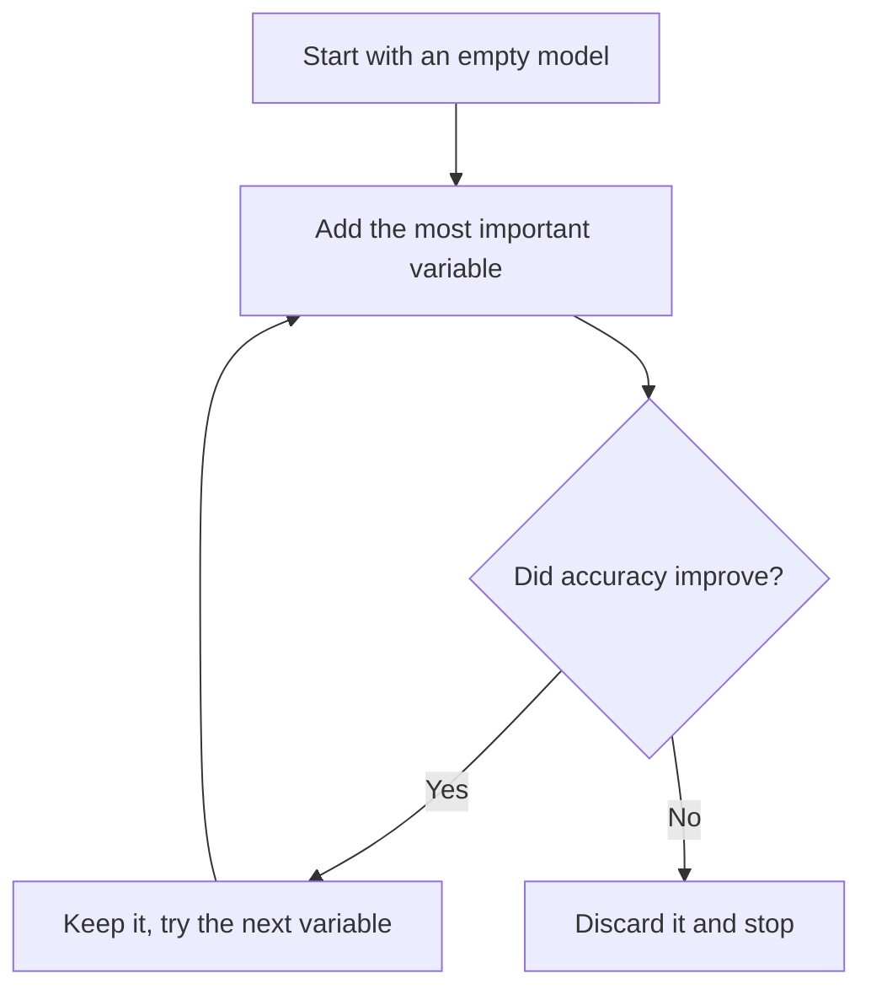
```mermaid
flowchart TD
    F1["Start with an empty model"] --> F2["Add the most important variable"]
    F2 --> F3{"Did accuracy improve?"}
    F3 -->|Yes| F4["Keep it, try the next variable"]
    F4 --> F2
    F3 -->|No| F5["Discard it and stop"]
```

**Backward elimination**

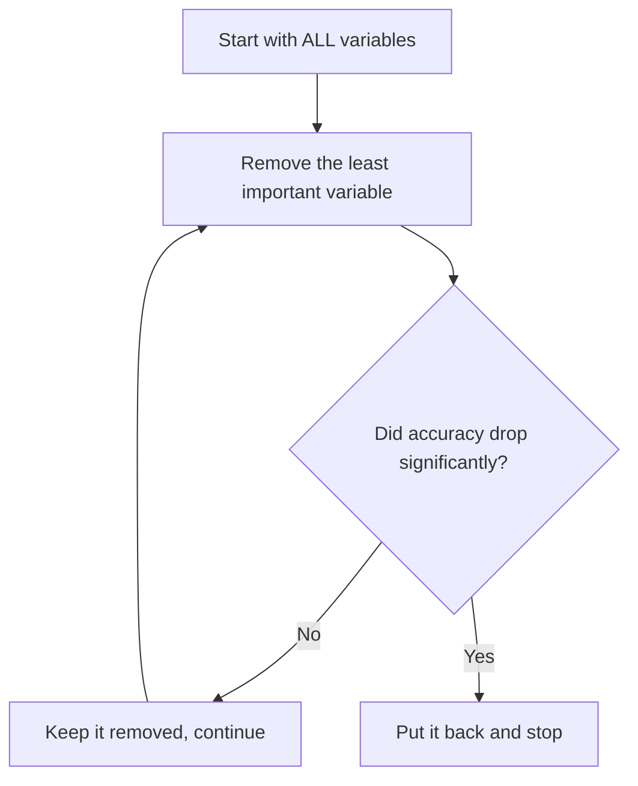
```mermaid
flowchart TD
    B1["Start with ALL variables"] --> B2["Remove the least important variable"]
    B2 --> B3{"Did accuracy drop significantly?"}
    B3 -->|No| B4["Keep it removed, continue"]
    B4 --> B2
    B3 -->|Yes| B5["Put it back and stop"]
```

Note: the original summary table listed Enter as starting "empty"; in standard practice Enter uses all variables at once.

**Additional methods:** stepwise selection (add and remove), regularization (Lasso shrinks some coefficients to zero), selection by AIC or BIC, and using diagnostic results (significant tests and correlations) to pre-screen features.

## 5.4 Classification (predicting categories)

| Algorithm | Idea |
|---|---|
| Logistic regression | Models probability with an S-shaped curve: p = 1 / (1 + e^-(b0 + b1 x)) |
| Naive Bayes | Applies Bayes' theorem assuming features are independent |
| Decision tree, random forest | Split data by rules; non-parametric |
| KNN | Classify by the nearest neighbors |

**Naive Bayes example:** an email with the words "free" and "winner". Prior P(spam) = 0.3. P(free given spam) = 0.6, P(winner given spam) = 0.4; P(free given not spam) = 0.05, P(winner given not spam) = 0.02.

- Spam score: 0.3 x 0.6 x 0.4 = 0.072. Not-spam score: 0.7 x 0.05 x 0.02 = 0.0007.
- P(spam given both words) = 0.072 / (0.072 + 0.0007) = **0.99**.

A classifier outputs a **probability**; a **cut-off** converts it into a class (see Part 6).

## 5.5 Regression versus forecasting (critical difference)

> The biggest confusion in data science. Many projects fail by mixing them up.

| Aspect | Regression (prediction) | Forecasting |
|---|---|---|
| Data source | Different individuals | The same individual over time |
| Variables | Multiple X to Y | Time series of ONE entity |
| Question | "What is Y for entity A based on entities B, C, D?" | "What will happen to entity A in the future?" |
| Based on | Cross-sectional data | Historical data |
| Core idea | Learn from OTHERS | Learn from SELF |
| Predicts for | A NEW entity | The SAME entity's future |
| Example | Rent for a new apartment | Next year's revenue of one shop |

**Regression: learn from others**

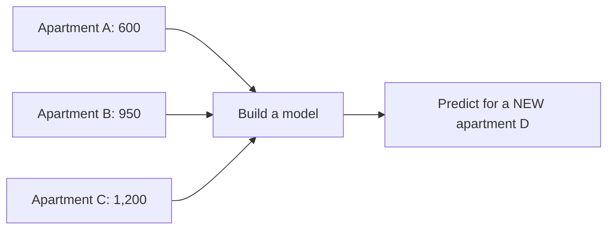
```mermaid
flowchart LR
    A1["Apartment A: 600"] --> M["Build a model"]
    A2["Apartment B: 950"] --> M
    A3["Apartment C: 1,200"] --> M
    M --> N["Predict for a NEW apartment D"]
```

**Forecasting: learn from self**

```mermaid
flowchart LR
    Y1["2021: 150"] --> T["Build a trend"]
    Y2["2022: 168"] --> T
    Y3["2023: 180"] --> T
    T --> FF["Forecast the SAME entity in 2024"]
```

**Regression scenario:** a car rental firm has data on other rentals (distance in km and price). It builds `Price = f(Distance)` from these other customers and predicts the price for a **new customer** with a 120 km trip. Data from other individuals is used for a new individual.

**Forecasting scenario:** annual revenue (thousand) of the SAME bakery.

| Year | 2019 | 2020 | 2021 | 2022 | 2023 |
|---|---|---|---|---|---|
| Revenue | 120 | 135 | 150 | 168 | 180 |

Linear trend (t = 1 to 5): slope 15.3, intercept 104.7. **Forecast for 2024 (t = 6) = 104.7 + 91.8 = 196.5.** Only this bakery's own history is used.

**Wrong approach:** using another bakery's data to forecast this bakery's sales. That would be regression, not forecasting.

## 5.6 Time series components

A **time series** is a sequence of data points measured over time for the **same entity**.

```mermaid
flowchart TD
    TS["Time series"] --> T["Trend (T)<br/>long-term direction"]
    TS --> S["Seasonal (S)<br/>repeats within a year"]
    TS --> C["Cyclical (C)<br/>repeats over more than a year"]
    TS --> I["Irregular (I)<br/>random shocks"]
```

| Component | Definition | Examples |
|---|---|---|
| Trend (T) | Long-term direction: up, down or stable | Sales rising year after year; population declining |
| Seasonal (S) | Regular patterns repeating within a year (or shorter) | Ice cream in summer, holiday shopping in December, term-start enrollments |
| Cyclical (C) | Patterns repeating over periods longer than a year | Economic expansions and recessions every 8 to 10 years, property cycles of 5 to 7 years, election cycles |
| Irregular (I) | Unpredictable fluctuations, no pattern | A pandemic shock, natural disasters, sudden supply disruption |

```text
Sales
  ^                                        /\
  |                          /\      /\   /  \    /
  |                /\   /\  /  \    /  \_/    \  /
  |       /\      /  \_/  \/    \__/            \/
  |  /\  /  \____/
  | /  \/
  +--------------------------------------------------> Time
    Overall rise = trend;  repeating waves = seasonal;  small random jumps = irregular
```

**Models:** additive `Y = T + S + C + I`; multiplicative `Y = T x S x C x I`.

**Forecasting methods**

| Method | Idea |
|---|---|
| Naive | Next value equals the last value |
| Moving average | Average of the last k values (lags behind trends). Last 3 years above: (150 + 168 + 180) / 3 = 166 |
| Exponential smoothing | Weighted average where recent data weighs more: F(t+1) = alpha x Y(t) + (1 - alpha) x F(t) |
| Linear trend | Regression of Y on time (as above) |
| Holt-Winters | Smoothing with trend and seasonality |
| ARIMA | Uses autocorrelation of past values and errors |

Evaluation: hold out the **most recent** periods as the test set (never shuffle time) and compare with MAE, RMSE or MAPE.

**Forecasting example: quarterly sales.** What will Kareem's Cafe sell in Q2 2027?

- Data needed: Kareem's Cafe quarterly sales from Q1 2023 through Q1 2027.
- Build the trend and seasonal pattern for this cafe only, then forecast its Q2 2027.
- Correct approach: use ONLY this cafe's history. Wrong approach: using a different cafe's data (that is regression).

Illustrative seasonal indices (average of the quarter versus the overall average):

| Quarter | Seasonal index | Meaning |
|---|---|---|
| Q1 | 0.85 | 15% below average |
| Q2 | 1.05 | 5% above average |
| Q3 | 1.25 | Peak season |
| Q4 | 0.85 | Slow period |

Forecast = trend value x seasonal index.

## 5.7 Model evaluation for classification

**Classification vocabulary.** In binary classification, the **positive** class is the outcome of interest.

| Domain | Positive | Negative |
|---|---|---|
| Disease screening | Has the disease | Does not |
| Cancer detection | Has cancer | No cancer |
| Bank fraud | Fraudulent transaction | Normal transaction |
| Customer churn | Customer leaves | Customer stays |

**Confusion matrix**

```text
                        PREDICTED
                   Positive      Negative
              +-------------+-------------+
ACTUAL  Pos   |     TP      |     FN      |
              +-------------+-------------+
        Neg   |     FP      |     TN      |
              +-------------+-------------+
```

| Outcome | Name | Meaning |
|---|---|---|
| TP | True positive | Model says positive, reality positive (correct) |
| TN | True negative | Model says negative, reality negative (correct) |
| FP | False positive (Type I error, "false alarm") | Model says positive, reality negative |
| FN | False negative (Type II error, "missed detection") | Model says negative, reality positive |

**Worked example: fraud detection.** 1,000 transactions: 50 are fraudulent and 950 are legitimate. At a 0.50 cut-off: TP = 40, FN = 10, FP = 19, TN = 931.

| | Predicted fraud | Predicted legit |
|---|---|---|
| Actual fraud | 40 | 10 |
| Actual legit | 19 | 931 |

| Metric | Formula | Value | Meaning |
|---|---|---|---|
| Accuracy | (TP + TN) / Total | 971 / 1000 = 97.1% | Overall correctness |
| TPR (sensitivity, recall, hit rate) | TP / (TP + FN) | 40 / 50 = 80% | Share of fraud detected |
| TNR (specificity) | TN / (TN + FP) | 931 / 950 = 98.0% | Share of legit correctly cleared |
| FPR | FP / (FP + TN) | 19 / 950 = 2.0% | False alarm rate (1 - TNR) |
| FNR | FN / (FN + TP) | 10 / 50 = 20% | Miss rate (1 - TPR) |
| Precision | TP / (TP + FP) | 40 / 59 = 67.8% | Of those flagged, how many are truly fraud |
| F1 | 2PR / (P + R) | 0.734 | Balance of precision and recall |

**Key relationships:** Sensitivity + FNR = 1; Specificity + FPR = 1; Error rate = 1 - Accuracy = (FP + FN) / Total.

| Metric | Formula | Numerator | Denominator | Measures |
|---|---|---|---|---|
| Accuracy | (TP + TN) / Total | Correct | All cases | Overall correctness |
| TPR | TP / (TP + FN) | Correct positives | All actual positives | Detection rate |
| TNR | TN / (TN + FP) | Correct negatives | All actual negatives | True negative rate |
| FPR | FP / (FP + TN) | Wrong positives | All actual negatives | False alarm rate |
| FNR | FN / (FN + TP) | Missed positives | All actual positives | Miss rate |

**Accuracy alone is misleading.** A useless model that labels every transaction "legit" scores **95% accuracy** (950 / 1000) but has TPR = 0%: it catches no fraud. Accuracy can be high while minority-class detection is poor, so always examine the confusion matrix.

**Metric priority**

| Priority | Metrics | Why |
|---|---|---|
| Critical | TPR (sensitivity) | Detecting positive cases |
| Critical | TNR (specificity) | Avoiding false alarms |
| Important | FPR | Cost implications |
| Important | FNR | Risk implications |
| Informative | Accuracy | Overall performance, can mislead |

- **High-sensitivity test:** good at detecting the condition but may raise false alarms (example: a cheap home screening kit).
- **High-specificity test:** good at confirming absence and avoiding false alarms but may miss some cases (example: a confirmatory lab test).

**ROC curve and AUC.** The ROC curve plots TPR against FPR for every possible cut-off. AUC is the area under it: 0.5 is random guessing, 1.0 is perfect. It compares models independently of any single cut-off.

```mermaid
flowchart LR
    M["Model outputs probabilities"] --> CO["Choose a cut-off"]
    CO --> CM["Confusion matrix"]
    CM --> ME["TPR, FPR, precision"]
    ME --> RO["Repeat for many cut-offs<br/>= ROC curve"]
```

---

# Part 6: PRESCRIPTIVE ANALYTICS

Prescriptive analytics answers **"What action should we take?"** and does so per individual, using classification, probabilities, expected values and optimization.

## 6.1 Expected value framework

**Purpose in data science**

1. Express models in monetary terms.
2. Calculate return on investment.
3. Minimize costs.
4. Quantify risks.
5. Make business decisions from model outputs.

| Traditional thinking | Data science thinking |
|---|---|
| "The model has 85% accuracy, so it is good." | "What is the financial impact of this model?" |

Questions to answer: how much profit will it generate, what do errors cost, what is the ROI, and how do we minimize risk while maximizing return? **Models must speak the language of money, not just accuracy.**

```text
Expected Value = sum of (Value of outcome x Probability of outcome)
```

## 6.2 Different stakeholders, different errors

Example: card fraud alerts.

| Stakeholder | Main concern | Why | Wants |
|---|---|---|---|
| Fraud and risk department | False negatives (missed fraud) | Losses, customer harm, regulatory exposure | Minimize FN, reduce risk |
| Customer experience and finance | False positives (blocked good transactions) | Investigation cost, angry customers, lost sales | Minimize FP, reduce cost |

```text
High sensitivity (low FN)   <->   High specificity (low FP)
      reduce risk           <->         reduce cost
```

Both cannot be perfect at once: there is always a trade-off.

## 6.3 Cut-off point selection

A classifier outputs a probability (for example P(fraud) = 0.75). A **cut-off** converts it into a decision.

**Misconception:** "always use 50%." The right cut-off depends on business objectives.

| Business goal | Cut-off strategy |
|---|---|
| Minimize cost | Higher cut-off (for example 0.90) |
| Minimize risk | Lower cut-off (for example 0.30) |
| Maximize profit | Calculate expected value |
| Achieve a target ROI | Derive from the ROI formula |

| Cut-off | Effect | Use when |
|---|---|---|
| 0.90 (high) | Few predicted positives; low FP (low cost); high FN (high risk); conservative | False alarms are very expensive |
| 0.50 (medium) | Balanced; moderate FP and FN | Costs are symmetric |
| 0.30 (low) | Many predicted positives; high FP (high cost); low FN (low risk); aggressive | Missing a positive is dangerous (for example screening) |

| As the cut-off increases | Effect |
|---|---|
| TP | Decreases |
| FP | Decreases |
| TN | Increases |
| FN | Increases |
| Sensitivity (TPR) | Decreases |
| Specificity (TNR) | Increases |
| Cost from FP | Decreases |
| Risk from FN | Increases |

**Worked example: choosing the cut-off by cost.** Assumptions: a missed fraud costs **$500** (FN); investigating a false alert costs **$15** (FP). There are 50 real frauds and 950 legitimate transactions. (Illustrative results.)

| Cut-off | TP | FN | FP | TN | TPR | FPR | Total cost |
|---|---|---|---|---|---|---|---|
| 0.15 | 49 | 1 | 190 | 760 | 98% | 20.0% | 1 x 500 + 190 x 15 = **$3,350** |
| 0.30 | 47 | 3 | 76 | 874 | 94% | 8.0% | 3 x 500 + 76 x 15 = **$2,640** |
| 0.50 | 40 | 10 | 19 | 931 | 80% | 2.0% | 10 x 500 + 19 x 15 = **$5,285** |
| 0.80 | 25 | 25 | 4 | 946 | 50% | 0.4% | 25 x 500 + 4 x 15 = **$12,560** |

The lowest cost is at about **0.30**, not the default 0.50. The best cut-off is set by the cost of errors.

**Worked example: marketing offer.** Contacting a customer costs **$2**; a responder is worth **$40** profit. Expected value of contacting a customer with response probability p:

```text
EV = p x (40 - 2) + (1 - p) x (-2) = 40p - 2
EV > 0 when p > 0.05
```

The optimal cut-off is **5%**, far below 50%. Contact everyone with a predicted probability above 5%.

**Target ROI or risk limit:** derive the cut-off from the required ROI, or use the highest cut-off that keeps the miss rate under a stated limit.

## 6.4 Comparing models with the expected value framework

Steps:

1. Build the confusion matrix for each model.
2. Calculate TPR, TNR, FPR, FNR.
3. Set business priorities: minimize cost, minimize risk, or hit a target ROI.
4. Select the model that best meets the objective.

**Example: predictive maintenance alerts for machines**

| | Model A | Model B |
|---|---|---|
| Accuracy | 95% | 88% |
| Sensitivity | 60% | 85% |
| Specificity | 98% | 89% |

| Situation | Choose |
|---|---|
| Inspections are cheap and breakdowns are costly | Model B (catch more failures) |
| Inspections are expensive and breakdowns are tolerable | Model A (avoid wasted inspections) |

## 6.5 Which metric matters by domain

| Domain | Positive class | Key metric | Why |
|---|---|---|---|
| Medical diagnosis | Disease present | Sensitivity | Missing disease is dangerous |
| Spam detection | Spam | Specificity | Losing real email annoys users |
| Fraud detection | Fraudulent transaction | Sensitivity | Missing fraud is costly |
| Airport security | Threat detected | Sensitivity | Missing a threat is catastrophic |
| Marketing campaign | Will respond | Balanced (expected value) | Both costs matter |

## 6.6 Decision framework

```mermaid
flowchart TD
    A["1. Define the business objective"] --> B["2. Identify the costs of FP and FN"]
    B --> C["3. Calculate expected value<br/>at different cut-offs"]
    C --> D["4. Choose the cut-off that<br/>optimizes the objective"]
    D --> E["5. Monitor and adjust in production"]
    E -.-> B
```

- **For data scientists:** accuracy alone is misleading; examine the confusion matrix; understand the business context; choose cut-offs from cost and risk trade-offs; speak the language of business impact.
- **For business stakeholders:** different errors have different costs; evaluation needs business input; thresholds should align with objectives; ROI can be calculated and optimized.

## 6.7 Optimization and personalization

- **Optimization** finds the best decision under constraints. Elements: decision variables, an objective (maximize profit or minimize cost), and constraints (budget, capacity). Linear programming is the basic method.
  - Example: with a retention budget of $10,000, choose which at-risk customers get which offer to maximize expected retained revenue.
- **Next best action:** for each customer, compute the expected value of each candidate action (offer A, offer B, no action) and choose the highest.
- **Uplift thinking:** target customers whose behavior the action actually changes, not those who would stay anyway.
- **Sensitivity analysis:** test how the decision changes if costs or probabilities shift.

| Customer | Risk score | Reason (diagnostic) | Best action (prescriptive) |
|---|---|---|---|
| A | High | Repeated late deliveries | Priority delivery slot plus credit |
| B | High | Skips weeks, low variety | Flexible pause or smaller box |
| C | Low | Stable | No offer (avoid wasted cost) |

---

# Part 7: ACTION

Action turns analysis into impact. The loop never ends: results flow back into new data.

```mermaid
flowchart LR
    A["Decide"] --> B["Deploy the model or rule"]
    B --> C["Run an experiment<br/>A/B test with hypothesis testing"]
    C --> D["Measure business results<br/>ROI, cost, risk"]
    D --> E["Monitor drift and errors"]
    E --> F["Retrain and update thresholds"]
    F --> A
```

| Step | What to do | Statistical link |
|---|---|---|
| Deploy | Integrate scoring and rules into the process | Cut-off from the expected value framework |
| Validate with an experiment | Compare treated versus control groups | Difference in proportions or means (Part 4) |
| Measure | Track profit, cost and risk, not only accuracy | Expected value |
| Monitor | Watch input distributions and error rates | Descriptive statistics, control charts |
| Detect drift | Compare current data with training data | Chi-square, t-tests, distribution checks |
| Refresh | Retrain when performance degrades; revisit cut-offs when costs change | Model evaluation |
| Communicate | Explain results in business terms with visuals | Interpretation over calculation |

**Ethics and governance:** check for biased features and unfair error rates across groups, protect privacy, document assumptions and keep humans in the loop for high-stakes decisions.

**Action checklist**

1. The decision and the owner are clear.
2. The cost of each error type is known.
3. The cut-off comes from business value, not a default.
4. A test or pilot confirms the action works.
5. Monitoring and a retraining trigger exist.

---

# Part 8: REFERENCE

## 8.1 Key takeaways by stage

| Stage | Key takeaways |
|---|---|
| Data | Know variable types and measurement levels; they decide valid methods. IDs are categorical. Choose sampling deliberately |
| Descriptive | Interpret, do not just calculate. Pair a center with a spread. Use the median for skewed data; use CV across scales; check outliers with IQR fences |
| Foundation | Empirical probability is used most. The complement rule saves time. Conditional probability and Bayes reverse the direction of inference |
| Diagnostic | A difference is not always a significant difference; p-value ≤ alpha rejects H0; test homogeneity; choose paired versus independent correctly; correlation is for quantitative variables, association for categorical |
| Predictive | Regression learns from others; forecasting learns from self. Guard against overfitting and select features systematically |
| Prescriptive | Evaluate models in money terms; set the cut-off from costs; personalize actions |
| Action | Experiment, monitor, retrain |

## 8.2 When to use each tool

| Use | When |
|---|---|
| Correlation | Exploring relationships between numeric variables, quantifying strength, checking assumptions |
| Association | Categorical variables, when only "does a relationship exist" is needed |
| Regression | Predicting for new individuals, several predictors, understanding variable importance |
| Forecasting | Predicting future va
